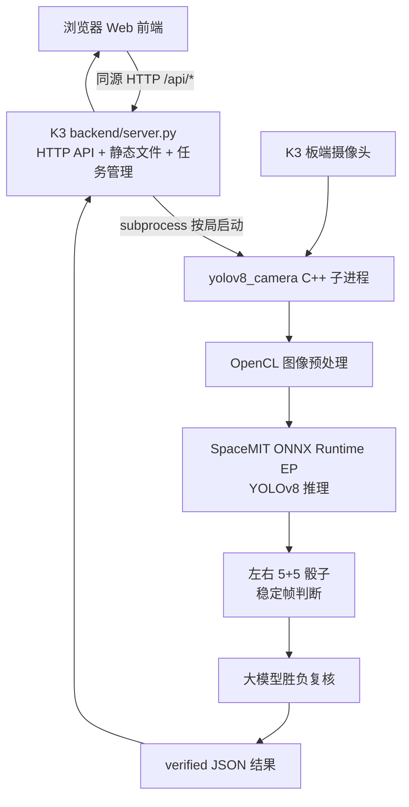
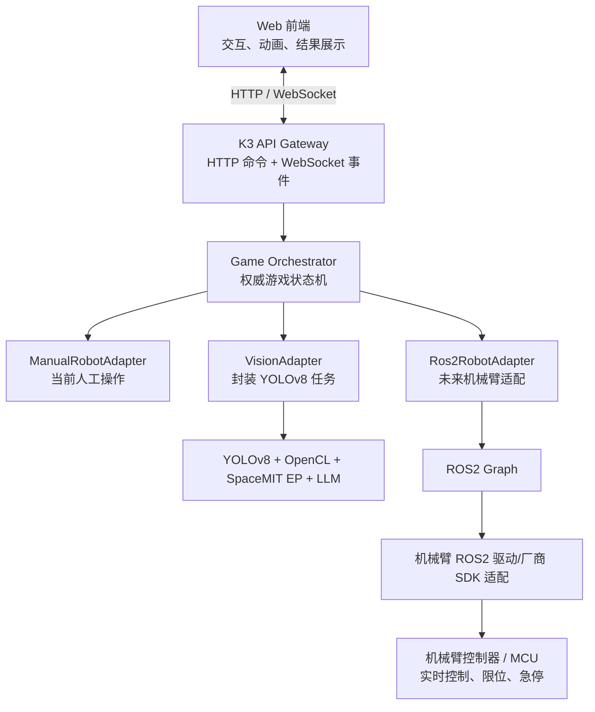

# Dice Arena 项目上下文（供后续 AI / 开发者快速接手）

> **用途**：新对话或新开发者进入项目时，先阅读本文件，再检查代码和板端实际状态。
> **记录日期**：2026-08-26
> **当前阶段**：K3 板端 Web 交互 + YOLOv8 骰子识别 + 大模型复核已接通；机械臂尚未接入，目前由人手完成摇骰、停骰和开盖。
> **重要原则**：本文将“已实现/已验证”和“未来规划”分开描述。未来规划不能被当成当前已有功能。

---

## 1. 项目目标

这是一个双方摇骰子的互动游戏 Demo：

1. 玩家在网页上选择“摇骰子”；
2. 双方准备并开始摇骰；
3. 当前阶段由人手替代机械臂完成摇骰、停骰、开盖；
4. K3 板端启动 YOLOv8，识别左右双方各 5 颗骰子；
5. YOLOv8 得到稳定结果后调用大模型复核；
6. 只有 YOLOv8 和大模型结论一致时，网页才展示有效胜负；
7. 后续加入机械臂，自动完成摇骰、停止、开盖、复位等动作。

当前只要求“摇骰子”游戏有效。游戏列表中的其他游戏仍可作为占位，不要误认为已经实现。

---

## 2. 仓库、分支和路径

### Git 仓库

```text
git@github.com:Fitz8863/spacemitk3-dice_demo.git
```

当前使用分支：

```text
main
```

本文件创建时的已提交基线：

```text
86f44a5 chore: expose board vision logs
```

创建本文件时，`main` 与 `origin/main` 指向同一提交，但工作区存在一个用户本地修改：

```text
vision/yolov8_objdetect/config.json
```

该修改涉及 LLM 模型配置。**不要擅自回滚、覆盖或把密钥写入 Git。** 后续操作前必须重新执行 `git status`，因为以上状态可能已经变化。

### 本地开发机看到的目录

```text
/home/heweijie/spacemit-k3-dev/projects/dice-game/main
```

### K3 板端真实目录

```text
/home/spacemit/projects/dice-game/main
```

当前目录是通过远程挂载映射到开发机的。文件编辑可以在本地挂载目录完成，但编译、摄像头、OpenCL、SpaceMIT EP、算力核和完整运行验证应在 K3 板端执行。

---

## 3. 当前目录结构

```text
main/
├── AI_PROJECT_CONTEXT.md            # 本文件，AI 接手入口
├── README.md                        # 项目运行说明；部分描述可能滞后，以代码和本文件为辅助
├── backend/
│   └── server.py                    # K3 HTTP 服务、静态文件服务、视觉任务管理
├── web/
│   ├── index.html                   # Web 页面结构
│   ├── app.js                       # 游戏交互、状态切换、后端调用
│   ├── tts-texts.json               # 所有状态的 TTS 文案、音色和语速
│   └── styles.css                   # 页面样式
├── vision/
│   └── yolov8_objdetect/
│       ├── src/                     # YOLOv8 C++ 源码
│       ├── models/best.q.onnx       # K3 使用的量化 ONNX 模型
│       ├── config.json              # 摄像头、推理、稳定帧、LLM 等配置
│       ├── CMakeLists.txt
│       └── build/yolov8_camera      # K3 编译产物，不纳入 Git
├── scripts/
│   ├── start_web.sh                 # 启动板端 Web/API 服务，并默认检查 TTS
│   ├── stop_web.sh                  # 停止 Web/API 服务
│   ├── start_tts.sh                 # 检查/启动迁移后的 Qwen3-TTS
│   ├── stop_tts.sh                  # 停止迁移后的 Qwen3-TTS
│   └── migrate_qwen3_tts_assets.sh  # 从板端原项目安全同步模型资产
├── tts/
│   └── qwen3-tts/                   # Qwen3-TTS + SpaceMIT llama-server
│       ├── runtime/bin/              # riscv64 runtime；可提交的小型二进制
│       ├── qwen3-tts-0.6b/           # 配置、模型权重和 speaker 文件
│       ├── docs/                     # realtime runtime 构建记录
│       └── patches/                  # realtime llama.cpp patch
├── deploy/
│   ├── dice-arena-web.service       # 可选 systemd Web 服务
│   └── dice-arena-tts.service       # 可选 systemd TTS 服务
└── .dice-arena.env                  # 板端本地密钥配置，不纳入 Git
```

以下是运行时文件，不应提交：

```text
web/.dice-arena-web.pid
web/dice-arena-web.log
backend/__pycache__/
.dice-arena.env
vision/yolov8_objdetect/build/
```

---

## 4. 当前已经实现的架构

### 4.1 架构图



### 4.2 前端和后端是否分离

当前是：

- **代码职责上分离**：`web/` 是前端，`backend/server.py` 是后端；
- **部署上没有完全分离**：同一个 Python HTTP 服务同时提供静态网页和 `/api/*`；
- **同源访问**：前端不需要单独配置 API 域名和 CORS；
- **当前没有 WebSocket**：前端通过 HTTP 轮询分析任务，轮询间隔约 700 ms。

典型访问地址：

```text
页面：http://<K3-IP>:8080/
接口：http://<K3-IP>:8080/api/*
```

不要把“逻辑分离”描述成“两个独立服务部署”，也不要声称当前已经使用 WebSocket。

### 4.3 当前 Web 游戏状态

前端主要阶段为：

```text
select
  → rules
  → ready
  → countdown
  → shaking
  → open
  → analysis
  → result
```

当前人为操作和按钮的对应关系：

| 页面操作 | 当前真实行为 | 未来机械臂行为 |
|---|---|---|
| 开始摇骰 | 页面进入摇骰状态，人手开始摇 | 下发机械臂摇骰 Action |
| 停止摇骰 | 页面停止动画，人手停骰 | 取消/完成摇骰 Action，机械臂停稳 |
| 双方已开盖 | 人手已开盖后启动视觉分析 | 机械臂开盖成功后自动启动视觉分析 |
| 再来一局 | 前端状态复位 | 机械臂回安全位、合盖、准备下一局 |

### 4.4 当前后端 API

```text
GET  /api/health
GET  /api/tts/health
POST /api/tts/synthesize
POST /api/analyze
GET  /api/analyze/<job_id>
POST /api/analyze/<job_id>/cancel
```

含义：

- `GET /api/health`：检查后端、YOLOv8、LLM 和 Qwen3-TTS 状态；
- `GET /api/tts/health`：检查板端 `llama-server` 是否可用；
- `POST /api/tts/synthesize`：把文本代理给 Qwen3-TTS 并返回 WAV；
- `POST /api/analyze`：创建一次板端视觉分析任务；
- `GET /api/analyze/<job_id>`：查询任务状态、阶段、日志和最终结果；
- `POST /api/analyze/<job_id>/cancel`：停止指定分析任务。

分析任务状态：

```text
queued → running → success
                 ↘ error
```

分析阶段：

```text
queued → starting → detecting → verifying → complete
                                      ↘ error
```

后端同一时间只允许一个 YOLOv8 分析任务运行，避免摄像头、TCM 或算力资源冲突。

### 4.5 当前 Qwen3-TTS 调用链

TTS 已迁移到当前项目的 `tts/qwen3-tts/`，但它仍作为独立的板端进程运行，不是在浏览器或 Python 里加载模型：

```text
Web app.js
  -> POST /api/tts/synthesize
  -> backend/server.py
  -> http://127.0.0.1:18080/v1/audio/speech
  -> tts/qwen3-tts/runtime/bin/llama-server
  -> SpaceMIT media backend + ONNX Runtime EP + Qwen3-TTS models
  -> 24 kHz mono WAV
```

因此当前前后端是“代码职责分离、同一个 HTTP 服务部署”，而 TTS 是第三个板端进程。网页优先播放 K3 TTS 返回的 WAV；只有服务不可用时才使用浏览器 `speechSynthesis` 兜底。后端对 TTS 请求加了串行锁，避免多个语音生成同时争抢模型和算力资源。

`/v1/audio/speech` 与 `/api/tts/synthesize` 当前都要等一个请求对应的完整 WAV 生成完毕后才返回，并非逐 PCM 帧流式。网页为长播报实现了分段级低延迟策略：按自然标点拆分文本，第一段 WAV 返回后立即播放，同时请求下一段，并保持顺序播放。后端的 `TTS_REQUEST_LOCK` 仍会串行化模型推理，避免单个 K3 TTS 服务被并发请求争抢。因此首段仍存在一次完整短句推理延迟；真正的 PCM 流式需要后续同时改造 `llama-server`、HTTP/WebSocket 转发和浏览器 Web Audio/MediaSource 消费链路。

当前接口：

```text
GET  /api/tts/health
POST /api/tts/synthesize    {"text":"...", "voice":"default", "speed":1.0}
```

### 4.6 TTS 文案配置

网页从 `web/tts-texts.json` 加载所有需要播报的文本，代码只引用状态键，不把业务文案散落在 `app.js`：

```json
{
  "version": 1,
  "voice": "default",
  "speed": 1.0,
  "texts": {
    "rules_intro": "...",
    "result_player_win": "...{player_score}...{agent_score}..."
  }
}
```

当前状态键：`rules_intro`、`rules_confirmed`、`shake_started`、`shake_stopped`、`analysis_started`、`result_tie`、`result_player_win`、`result_agent_win`。胜负结果使用 `{player_score}` 和 `{agent_score}` 动态替换。修改 JSON 后刷新板端浏览器即可生效；JSON 加载失败时会提示并跳过该次 K3 TTS 请求。

TTS 上游必须使用：

```json
{
  "model": "qwen3-tts",
  "input": "骰子游戏开始，请双方准备。",
  "voice": "default",
  "response_format": "wav",
  "speed": 1.0
}
```

已在板端原项目验证过 `/health` 和 `/v1/audio/speech`；迁移切换后仍必须确认 `readlink -f /proc/<pid>/exe` 指向：

```text
/home/spacemit/projects/dice-game/main/tts/qwen3-tts/runtime/bin/llama-server
```

不要只看端口健康就声称使用了迁移目录，因为旧的 `/home/spacemit/projects/qwen3-tts` 服务也可能占用 18080。`scripts/start_tts.sh` 会拒绝复用不同 runtime；切换前应显式停止旧服务。

TTS 资产策略：模型文件约 2 GiB，`*.onnx`、`*.gguf`、speaker `.bin` 和参考录音不提交 GitHub。迁移使用：

```bash
cd /home/spacemit/projects/dice-game/main
scripts/migrate_qwen3_tts_assets.sh
```

脚本只复制当前配置指定的 speaker 文件，不复制 `voice_presets/source_audio` 或未配置的 embedding。`runtime/bin/` 约 18 MiB，可作为 K3 riscv64 runtime 随仓库提交；若重新克隆后模型资产缺失，必须在板端重新执行迁移脚本或准备资产包。

### 4.6 当前 YOLOv8 调用链

后端不是在浏览器里运行 YOLOv8，也不是使用随机数判胜。点击“双方已开盖”后，`backend/server.py` 在 K3 上启动：

```text
vision/yolov8_objdetect/build/yolov8_camera
```

主要参数包括：

```text
--config config.json
--no-display
--rejudge-on-change
--require-llm
--result-file /tmp/dice-arena-<job_id>.json
--exit-on-result
```

含义：

- 使用配置文件里的板端摄像头；
- 不打开本地图形显示窗口；
- 检测结果变化时重新判断；
- 必须经过 LLM 复核；
- 将有效结果写到临时 JSON；
- 得到有效结果后退出进程。

**YOLOv8 不是常驻进程。** 空闲时看不到 `yolov8_camera` 是正常的；它只在分析任务期间运行，完成或失败后退出。

当前有效结果要求：

1. 左右双方各识别到 5 颗骰子；
2. 检测达到配置要求的稳定帧数；
3. YOLOv8 算出双方点数和胜负；
4. LLM 根据双方整数和复核胜负；
5. LLM 与 YOLOv8 结论一致；
6. 最终 JSON 中 `verified` 为 `true`。

结果结构示例：

```json
{
  "verified": true,
  "source": "yolov8+llm",
  "first_name": "LEFT",
  "second_name": "RIGHT",
  "first_dice": [1, 1, 2, 3, 6],
  "second_dice": [1, 3, 4, 5, 6],
  "first_sum": 13,
  "second_sum": 19,
  "yolo_winner": "RIGHT",
  "llm_winner": "RIGHT",
  "winner": "RIGHT"
}
```

如果 YOLOv8 超时、数量不为 5+5、LLM 未配置、LLM 调用失败或两者结论不一致，前端应显示错误，不能使用随机骰子兜底。

### 4.7 摄像头边界

网页中的摄像头预览和 YOLOv8 使用的摄像头链路不是同一个数据流：

- 浏览器预览：浏览器的 `getUserMedia()`；
- YOLOv8 识别：K3 C++ 程序读取 `vision/yolov8_objdetect/config.json` 中指定的板端摄像头。

因此：

- 浏览器画面目前不会自动传给 YOLOv8；
- 两边同时打开同一个物理摄像头可能出现设备占用；
- 后续应优先由板端统一管理摄像头，再向网页推送预览或检测画面。

---

## 5. 当前运行方式

### 5.1 在 K3 上启动

```bash
ssh spacemit@<K3-IP>
cd /home/spacemit/projects/dice-game/main
scripts/start_tts.sh
scripts/start_web.sh
```

默认监听：

```text
0.0.0.0:8080
```

### 5.2 停止

```bash
cd /home/spacemit/projects/dice-game/main
scripts/stop_web.sh
scripts/stop_tts.sh
```

### 5.3 健康检查

```bash
curl http://127.0.0.1:8080/api/health
curl http://127.0.0.1:8080/api/tts/health
```

重点检查：

```json
{
  "ok": true,
  "yolo_ready": true,
  "llm_configured": true,
  "tts_ready": true
}
```

### 5.4 检查分析期间的进程和日志

```bash
pgrep -af yolov8_camera
tail -f /home/spacemit/projects/dice-game/main/web/dice-arena-web.log
```

只有网页发起分析后才预期看到 `yolov8_camera`。

---

## 6. 密钥和配置安全

LLM API Key 不应出现在：

- `web/` 前端代码；
- HTTP API 响应；
- Git 提交；
- README 或本上下文文档；
- 可公开的运行日志。

板端使用未纳入 Git 的文件：

```text
/home/spacemit/projects/dice-game/main/.dice-arena.env
```

示意格式：

```text
DICE_LLM_API_KEY=<secret>
```

权限建议：

```bash
chmod 600 .dice-arena.env
```

`vision/yolov8_objdetect/config.json` 中的 `llm.api_key` 应保持为空，真实密钥由环境变量提供。

---

## 6.1 TTS 当前验证与注意事项

截至 2026-08-26，旧源项目中的服务曾运行于：

```text
/home/spacemit/projects/qwen3-tts/runtime/bin/llama-server
--media-backend smt --smt-config-dir /home/spacemit/projects/qwen3-tts/qwen3-tts-0.6b
--host 127.0.0.1 --port 18080 --no-ui
```

已验证迁移后的 Dice Arena TTS 服务返回 RIFF/WAVE、24 kHz、16-bit、mono 音频，且进程实际加载 `/usr/lib/libonnxruntime.so.1.24.2+spacemit.a1` 和 `/usr/lib/libspacemit_ep.so.2.0.6`。以下命令可用于重新验证当前板端状态：

```bash
cd /home/spacemit/projects/dice-game/main
scripts/stop_web.sh || true
cd /home/spacemit/projects/qwen3-tts && ./stop_server.sh
cd /home/spacemit/projects/dice-game/main
scripts/start_tts.sh
pgrep -af llama-server
pid="$(cat tts/qwen3-tts/llama-server.pid)"
readlink -f "/proc/$pid/exe"
tr '\0' ' ' <"/proc/$pid/cmdline"; echo
curl -fsS http://127.0.0.1:18080/health
scripts/start_web.sh
curl -f http://127.0.0.1:8080/api/tts/synthesize \
  -H 'Content-Type: application/json' \
  -d '{"text":"骰子游戏开始，请双方准备。","speed":1.0}' \
  -o /tmp/dice-tts.wav
file /tmp/dice-tts.wav
```

确认 TTS 的 SpaceMIT/ORT 实际加载时，再检查：

```bash
grep -E 'libonnxruntime|libspacemit_ep' "/proc/$pid/maps" | awk '{print $6}' | sort -u
```

preferred core、CPU affinity 和环境变量只能说明配置意图，不能单独证明 AI Core 已被实际使用。

## 7. 当前架构的能力边界

当前轻量 HTTP 后端足以完成：

- Web 页面交互；
- 单局游戏状态切换；
- 启动、查询、取消 YOLOv8 分析任务；
- 收集 C++ 进程日志；
- 返回 YOLOv8 + LLM 复核结果；
- 代理板端 Qwen3-TTS 并向浏览器返回 WAV。

当前架构还不具备：

- 机械臂驱动；
- ROS2 节点、Topic、Service 或 Action；
- 机械臂动作反馈和取消语义；
- 机器人急停、限位、安全区域管理；
- 多模块统一事件总线；
- 可靠的全局游戏流程状态机；
- WebSocket 实时推送；
- K3 统一摄像头服务和检测画面推流；
- 进程崩溃后的完整任务恢复。

`backend/server.py` 当前是一个适合 Demo 的轻量 bridge，不应直接承担机械臂关节级实时控制。

---

## 8. 未来接入机械臂时的推荐架构

### 8.1 核心结论

不建议把当前 Web/HTTP 系统全部替换成 ROS2。推荐混合架构：

- **Web 前端**：只负责用户交互和展示；
- **HTTP/WebSocket Gateway**：对浏览器提供稳定 API；
- **Game Orchestrator**：管理整局游戏状态和模块编排；
- **ROS2**：作为机器人内部模块之间的中间件；
- **机械臂控制器/MCU**：负责底层实时运动和安全；
- **Vision Adapter**：封装现有 YOLOv8 + LLM 链路。

### 8.2 未来架构图



浏览器不能直接控制机械臂，也不应直接连接机械臂厂商 SDK。所有机械臂动作必须经过后端状态机、安全检查和适配层。

---

## 9. 推荐的软件模块划分

未来可以演进为：

```text
backend/
├── server.py                    # HTTP/WebSocket 入口；不写具体设备逻辑
├── game_orchestrator.py         # 游戏权威状态机和流程编排
├── models.py                    # GameState、Command、Event、Result 数据结构
├── event_bus.py                 # 内部事件发布/订阅
├── adapters/
│   ├── robot_base.py            # 机械臂统一抽象接口
│   ├── robot_manual.py          # 当前人工确认实现
│   ├── robot_ros2.py            # ROS2 Action/Service 客户端
│   ├── vision_base.py           # 视觉统一抽象接口
│   └── vision_process.py        # 现有 yolov8_camera 子进程适配器
└── transports/
    ├── http_api.py              # 命令 API
    └── websocket.py             # 状态、进度和日志推送

ros2_ws/
└── src/
    ├── dice_robot_msgs/         # 自定义 msg/srv/action
    ├── dice_robot_driver/       # 机械臂或厂商 SDK 驱动节点
    ├── dice_robot_bringup/      # launch、参数和部署配置
    └── dice_safety_monitor/     # 可选安全状态监控节点
```

现有 C++ YOLOv8 不需要立即重写为 ROS2 节点。第一阶段继续通过 `VisionAdapter` 启动已验证的 `yolov8_camera`，等接口和部署稳定后，再决定是否封装成 ROS2 node。

---

## 10. 机械臂抽象接口建议

先定义统一接口，再决定底层使用 ROS2、TCP、串口、CAN 或厂商 SDK：

```python
class RobotAdapter:
    def get_status(self): ...
    def enable(self): ...
    def disable(self): ...
    def home(self): ...
    def shake_dice(self, side: str, duration_s: float, intensity: float): ...
    def stop_shake(self, side: str): ...
    def open_cup(self, side: str): ...
    def close_cup(self, side: str): ...
    def move_to_safe_pose(self): ...
    def cancel(self, command_id: str): ...
    def reset_error(self): ...
```

当前阶段实现：

```text
ManualRobotAdapter
```

它不移动机械臂，只等待网页或工作人员确认动作完成。后续机械臂到位后替换为：

```text
Ros2RobotAdapter
```

这样前端 API 和游戏状态机不用推倒重写。

---

## 11. ROS2 在未来系统中的职责

ROS2 适合承担机器人内部通信和长动作管理，但不是网页替代品。

建议映射：

### Topic：持续状态和事件

```text
/dice/robot/state
/dice/robot/error
/dice/vision/status
/dice/game/event
/joint_states
```

### Service：短时请求/响应

```text
/dice/robot/enable
/dice/robot/disable
/dice/robot/home
/dice/robot/reset_error
```

### Action：耗时、需要进度反馈和取消的动作

```text
/dice/robot/shake
/dice/robot/open_cup
/dice/robot/close_cup
/dice/robot/move_to_pose
```

机械臂动作应使用 Action 风格，因为需要：

- goal/命令 ID；
- 执行中反馈；
- 成功或失败结果；
- 超时；
- 取消；
- 错误码。

YOLOv8 分析也可以在系统内部采用类似 Action 的任务语义，但现阶段保留现有 HTTP job + 子进程实现即可。

---

## 12. 未来权威游戏状态机

建议由后端 `Game Orchestrator` 成为唯一权威状态源：

```text
IDLE
  → PREPARING
  → READY
  → SHAKING
  → STOPPING
  → OPENING_CUPS
  → VISION_DETECTING
  → LLM_VERIFYING
  → RESULT
  → RESETTING
  → READY
```

任何阶段都可能进入：

```text
ERROR
EMERGENCY_STOP
CANCELLED
```

推荐原则：

1. 前端只发送意图，如 `start_round`、`stop`、`cancel`；
2. 前端不能自行宣布机械臂动作成功；
3. Orchestrator 根据机械臂反馈决定是否进入下一状态；
4. 开盖 Action 成功后才允许启动视觉分析；
5. 视觉 `verified:true` 后才允许发布最终胜负；
6. 新一局之前必须确认机械臂已回安全位、骰盅状态正确；
7. 急停、超时或驱动离线时，状态机必须停止自动推进。

---

## 13. 建议的 Web API / WebSocket 方向

未来可以保留当前 `/api/analyze`，同时逐步增加游戏级接口：

```text
POST /api/game/rounds
POST /api/game/rounds/<round_id>/start
POST /api/game/rounds/<round_id>/confirm-manual-step
POST /api/game/rounds/<round_id>/cancel
GET  /api/game/rounds/<round_id>
GET  /api/system/health
```

WebSocket 可用于服务器主动推送：

```text
/ws/events
```

事件示例：

```json
{
  "event": "robot.action.feedback",
  "round_id": "round-001",
  "command_id": "cmd-001",
  "state": "SHAKING",
  "progress": 0.65,
  "timestamp_ms": 1787712000000
}
```

注意：

- HTTP 适合提交命令、查询快照；
- WebSocket 适合推送状态、进度、日志；
- WebSocket 断开不应导致机械臂失控；
- 后端状态机必须独立于浏览器连接继续安全运行；
- 所有命令应具备 `round_id`、`command_id` 和幂等/重复请求处理。

---

## 14. 机械臂部署位置决策

不能预先假设机械臂 ROS2 驱动一定能在 K3/riscv64 上运行。接入前必须确认：

- 机械臂品牌、型号、控制器；
- 厂商 SDK 支持的 CPU 架构；
- 是否提供 ROS2 驱动；
- ROS2 发行版要求；
- 驱动依赖是否支持 riscv64；
- 通信方式是 Ethernet、串口、CAN、USB 还是其他；
- 控制器是否已经处理轨迹插补、限位和急停。

可能的两种部署：

### 方案 A：全部在 K3

```text
K3：Web + Gateway + Orchestrator + YOLOv8 + ROS2 + 机械臂驱动
```

适用于 ROS2 和机械臂驱动都能在 K3/riscv64 稳定运行的情况。

### 方案 B：K3 + 机器人控制主机

```text
K3：Web + Gateway + Orchestrator + YOLOv8
机器人主机：ROS2 + 厂商驱动 + 机械臂控制
```

两台主机通过 ROS2 网络或定义明确的 TCP/gRPC/HTTP 协议通信。若厂商只支持 x86_64/ARM64，优先采用这个方案，不要强行把不可用驱动移植到 K3 后才推进项目。

---

## 15. 推荐演进顺序

### 阶段 1：保持当前功能可用，先抽象模块

1. 把视觉子进程逻辑移到 `VisionAdapter`；
2. 新建 `RobotAdapter`；
3. 实现 `ManualRobotAdapter`；
4. 新建后端权威 `GameOrchestrator`；
5. 前端改为消费后端游戏状态，不自行推进关键硬件状态。

### 阶段 2：增加实时状态通道

1. 保留 HTTP 命令接口；
2. 增加 WebSocket 状态和日志推送；
3. 增加 `round_id`、`command_id`、超时和取消；
4. 增加断线重连后的状态恢复。

### 阶段 3：接入机械臂仿真或 Mock

1. 用 Mock/仿真 RobotAdapter 模拟执行进度；
2. 验证摇骰、停止、开盖、回位完整状态机；
3. 验证超时、取消、失败、急停；
4. 不连接真实机械臂也要能完整测试流程。

### 阶段 4：接入 ROS2 和真实机械臂

1. 确认机械臂型号、驱动和部署主机；
2. 定义 ROS2 msg/srv/action；
3. 实现 `Ros2RobotAdapter`；
4. 先低速、空载、单动作验证；
5. 加入安全位、限位、急停和人工接管；
6. 最后接入完整游戏自动流程。

### 阶段 5：视觉服务化

1. 统一摄像头所有权；
2. 向网页推送板端检测画面；
3. 评估 YOLOv8 常驻服务或 ROS2 node；
4. 保持 SpaceMIT EP、OpenCL 和 LLM 链路的板端验证证据。

---

## 16. 安全和工程约束

接入真实机械臂后必须遵守：

- HTTP/WebSocket/ROS2 只发送高层动作，不执行关节级硬实时闭环；
- 轨迹插补、关节限位、碰撞保护和急停应由控制器或可靠的机器人控制层负责；
- 网页按钮不能代替硬件急停；
- 机械臂未使能、未回零、驱动离线或安全状态异常时禁止启动游戏；
- 每个动作必须有超时和可追踪的错误码；
- 进程退出、网络断开或浏览器刷新时，机械臂必须进入定义明确的安全行为；
- 视觉失败不能触发未经确认的机械臂连续动作；
- 不要同时启动多个会争用摄像头或 K3 算力资源的视觉任务。

---

## 17. 新 AI 接手时的检查清单

不要只依赖本文。开始修改前依次执行：

```bash
pwd
readlink -f .
git status --short --branch
git log -5 --oneline --decorate
```

然后确认：

1. 当前是否仍在 `main` 分支；
2. 工作区是否有用户未提交修改；
3. K3 板端目录是否仍为 `/home/spacemit/projects/dice-game/main`；
4. Web 服务是否运行；
5. `/api/health` 是否返回 `yolo_ready:true` 和 `llm_configured:true`；
6. 摄像头设备编号是否仍与 `config.json` 一致；
7. `yolov8_camera` 是否为 K3 最新编译产物；
8. 当前任务是否允许改动或提交用户的本地配置；
9. 机械臂是否已经确定品牌、SDK、ROS2 驱动和部署架构；
10. 所有“已验证”结论是否有当前板端日志或运行证据。

如果要提交代码：

- 只提交本次任务相关文件；
- 不提交 `.dice-arena.env`、API Key、日志、PID、build 目录；
- 不覆盖用户未提交的 `config.json` 修改；
- 在 K3 上完成必要编译和有界运行测试后，再推送；
- 用户当前约定的目标仓库和分支是 `origin/main`，但推送前仍需重新确认远端和分支状态。

---

## 18. 一句话交接结论

当前项目是一个运行在 K3 上的同源 Web + 轻量 HTTP bridge，已经通过子进程真正调用板端 YOLOv8、SpaceMIT EP 和 LLM 复核来判断骰子胜负；当前人工动作应先抽象为 `ManualRobotAdapter`，未来保留 Web/HTTP/WebSocket 层，并增加 `GameOrchestrator + Ros2RobotAdapter`，让 ROS2 负责机器人内部协同，而不是推翻现有前后端或让浏览器直接控制机械臂。
