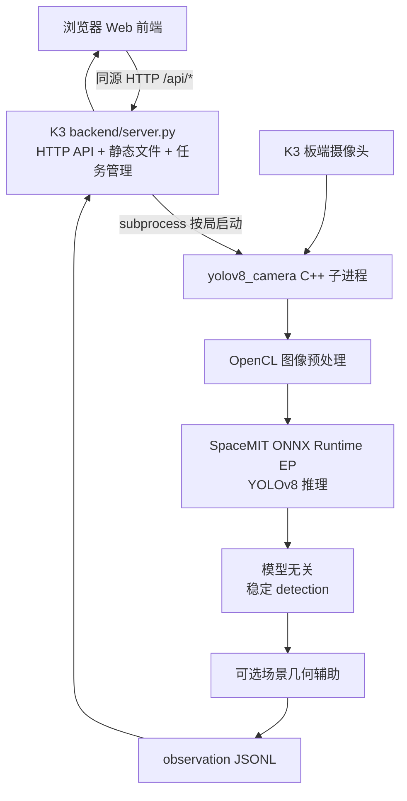
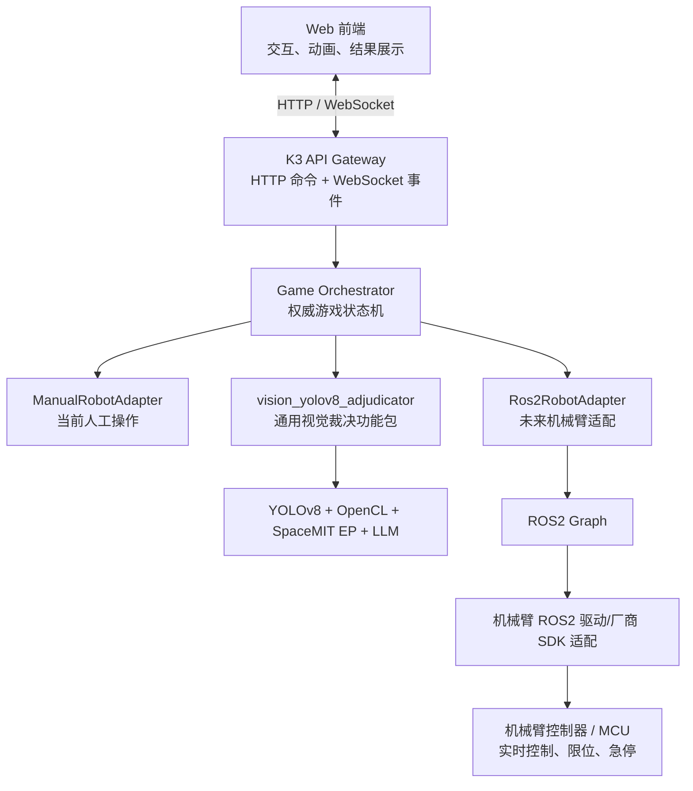

# Dice Arena 项目上下文（供后续 AI / 开发者快速接手）

> **用途**：新对话或新开发者进入项目时，先阅读本文件，再检查代码和板端实际状态。
> **记录日期**：2026-09-01
> **当前阶段**：K3 板端 Web 交互 + YOLOv8 骰子识别 + 大模型复核已接通；机械臂尚未接入，目前由人手完成摇骰、停骰和开盖。
> **重要原则**：本文将“已实现/已验证”和“未来规划”分开描述。未来规划不能被当成当前已有功能。

## 当前实现覆盖（2026-09-01）

2026-09-02 起游戏调度升级为**后端权威状态机**：`backend/games/<game_id>/manifest.json` 的
`state_machine` 节点（校验器 `backend/core/state_schema.py`、引擎 `backend/core/state_machine.py`
的 `GameRound`）声明每个状态的 on_enter 动作（speech/adjudicate，未来 robot）、意图转换表、
计时器与事件路由；后端通过 `/api/game/rounds` 系列 API 驱动整局，前端 `web/app.js`
（`createRoundClient` + `playDirective`）只提交意图、渲染事件、播台词并在 `await` 指令播完
回执 `speech_done`。旧 `texts` 台词表与 `/api/speech/stream` 已移除（台词内联进 speech 动作，
音频经 `/api/game/rounds/<id>/speech` 按指令拉帧）。`/api/adjudicate` 保留为调试入口。
一局 = 一个 round，刷新即放弃（新 round 自动取消旧活动 round）。已在 K3 板端完成全流程
验证（含 停→开盖→4 秒过场节奏、0.9 秒倒计时、真实 YOLO+LLM 裁决、热加载）。

2026-09-02 起新增**语音输入通道（ASR）**：`asr/zipformer-streaming`（从
`~/projects/asr` 移植入库的 C++ 真流式 Zipformer，`--jsonl` 输出机器可读事件；模型按
项目 .gitignore 不入库，tarball 分发见其 README）+ `backend/components/asr_zipformer`
功能包（`type=asr`，继承 `core/asr.py` 的 `AsrProvider`，回合期间按需 spawn
`arecord | stream_asr --pcm --jsonl` 子进程对，无 lifecycle 不进 start_web.sh）+
`core/asr_bridge.py`（识别句 → manifest `asr.phrases` 归一化子串匹配 →
`submit_intent` 注入，与按键同路，引擎零改动）。**播报闸**：speech 指令发出即登记
`_active_speech`，前端现在对**所有**指令回执 `speech_done`（不再仅 `await:true`，
回执统一在 `playDirective` 的 finally 块），无回执 90s 惰性过期——播报期间语音输入
无效，按键不受限。开关 = 游戏 manifest `asr.enabled`（热加载）；麦克风跟随系统默认
输入设备。已在板上验证：会话拉起/EP 模型加载/播报闸登记与释放/取消回合自动停麦/
开关热切换/进程无泄漏；真实人声「确认」跳转待人工验证。已知边界：server 被 SIGKILL
时 setsid 的 ASR 子进程可能残留（SIGTERM 路径干净停麦）；ASR EP 线程与主进程同在
X100 0-7 簇（RTF≈0.24 占用可接受，组件 config 预留 `cpu_affinity` 旋钮）。

2026-09-03（晚）起 **ASR 引擎改为进程级常驻**（上一段"按回合 spawn/停麦"的描述
以此为准作废）：`asr_zipformer` 的 `_AsrEngine` 常驻 `arecord | stream_asr` 进程对，
"会话"退化为引擎上的**路由**（`start_session`/`stop_session` = attach/detach 瞬时
换绑回调，签名不变）。后端启动时与本地 TTS 预热**并行**预热 ASR（`asr_enabled=true`
且配了 `providers.asr`；实测 zipformer 加载 ~2.6s，双预热并行开机共 ~7s），失败拒绝
启动；待机唤醒与回合语音的切换是路由换绑不再付模型加载（板上实测 standby listen
POST 25ms、回合创建 72ms、整局单一 stream_asr 进程）。回合终结由 watcher 摘路由，
引擎保温；意外死亡自愈（存活 >30s 的死亡后台重启重挂，短命死亡等下次 attach 防
崩溃循环）。`core/asr_bridge.py` 只改文档语义（桥拥有麦克风路由），播报闸/多候选/
观测事件不变。**ASR 槽位全局唯一封口**（`arena_config.collect_provider_slot_ids` +
server 启动/热加载双路校验）：`providers.asr` 解析出两个引擎 id 即拒启/拒换。待机
监听空闲 CPU 实测 ~0.6 核（VAD 常开，非本次引入——旧会话模式同样烧）。

2026-09-03（晚 II）起新增**语音选游戏**：列表页与待机页均可点名游戏直达对局
（说"我想玩摇骰子游戏"即进 dice；词表在全局配置 `backend/config.json`
`game_select.phrases` 按游戏 id 显式声明——游戏列表是部署面，词表归全局、
manifest 不管，未声明的游戏不参与）。2026-09-04 补**语音确认进入**：列表页
上下键/点选高亮游戏后，说"进入游戏/玩这个游戏"（全局配置
`game_select.confirm_phrases`，保留路由键 `confirm` → 前端走绿色按钮同一条
`enterSelectedGame` 路径；匹配优先级游戏名 > 确认词；待机页无选中态故不生效）。

2026-09-04 **LLM 大模型模块化**（第四类组件，与前三类同构）：`core/llm.py` 定义
`LlmProvider` 契约（`verify`/`diagnose` 两个有界结构化多模态请求——纯传输适配器，
不知道任何游戏规则；提示词/allowed_outcomes/超时是游戏语义，随每次调用传入）。
首个实现 `llm_openai_compat`：纯 HTTP OpenAI 兼容客户端（endpoint/model/api_key 在
其组件 config，原视觉组件 llm 节三件套迁移至此；客户端代码原为视觉组件的 llm.py，
整体平移）。接线：全局 `providers.llm` **单责任槽**（heweijie 拍板，与 asr/
vision_adjudicator 同形而非 TTS 双槽——LLM 复核每局只用一个引擎，本地 llamacpp
落地后同槽切换即可）→ dice pipeline **每回合**解析（manifest 覆盖 > 全局，热加载，
改槽值下一回合生效免重启）→ 引擎经 `VisionAdjudicationRequest.llm_provider` 新字段
送进裁决器（构造 `verifier` 保留为测试注入缝，请求携带者优先）。槽缺失/坏槽位/
启动探测失败（GET /models 软探测）一律**软降级**：复核自动 disabled、YOLO 兜底、
绝不拒启不杀回合（`llm_status: disabled` 与 profile 级禁用同语义）。`/api/health`
的 `llm_configured` 改由 llm 槽位+组件配置回答（adjudicator 健康不再携带 LLM 状态）。
`vision_yolov8_adjudicator` 就此只管 YOLO 检测与裁决流程。将来 `llm_llamacpp`
（常驻 llama-server + 预热）实现同契约即可接入。

2026-09-03（深夜）**AEC（回声消除）调研与试做：结论为暂不启用，播报闸仍是主防线**。
动因是"ASR 会听到 TTS 相同语句"。实测链路：TTS 由浏览器播放——平时演示浏览器在
笔记本上（日志证实全部 /speech 拉取来自 100.113.182.54），AEC 参考信号在笔记本侧，
板端架构上无法消除；全板子演示形态（板载屏幕+Chromium+本地喇叭+板载麦克风）下，
参考信号可得。试做了两条路线：① gst webrtcdsp/echoprobe 双分支管线（WAP 1.3 已装，
管线能 PLAYING，但 dsp 无 probe 配对握手时完全不吐数据，黑盒调不通）；② PipeWire
原生 module-echo-cancel（板上 spa-0.2/aec/libspa-aec-webrtc.so 后端齐全，配置
~/.config/pipewire/pipewire.conf.d/99-echo-cancel.conf 加载成功、虚拟 aec_source/
aec_sink 建立并切默认，但实测 AEC 输出比原始麦更响更噪——后端疑似静默劣化，且无
日志线索，需源码级排查后才能用）。两条路线均已回退（板端音频恢复 MCHOSE 直采直放、
仓库无 AEC 代码改动）。关键实测数据：板载出声口是内置 3.5mm 模拟（platform-soc_
sound-card_1），播放时麦克风 RMS 33→112~5388（随音量/摆位波动），且**回声在多数
运行中不可被 ASR 转写**（0 token，仅最大音量一次 1 句）——播报闸 + 低可转写性已
双重覆盖当前风险。若未来实测出现误触发：优先降喇叭音量/改摆位，其次重启 AEC 排查
（PipeWire 配置模板与全部坑记录在项目记忆 asr-voice-input 的 AEC 节）。`start_standby_session`
泛化为 bridge 的 `start_select_session`（词表 {key: 触发词}，首命中按表序）；
待机/列表各自事件总线（`_AsrEventBus` 类，listen:true 清总线开新纪元），
新端点 `POST/GET /api/asr/select(/events)`。关键规则：**游戏名优先于唤醒词**
（唤醒词"游戏"是"摇骰子游戏"的子串）。前端 selected 事件走与绿色按钮同一
`enterSelectedGame` 路径；待机页 selected 唤醒+直达。喇叭回声安全：
create_round 在 POST 返回前已摘 select 路由。板端实测 select listen 26ms、
词表正确、全程单一 stream_asr。


2026-09-03（下午）起新增**本地 TTS 引擎 `tts_matcha`**（第四个 TTS provider）：
引擎源码与板端资产落位 `tts/matcha-tts/`（cpp 三件套：capi 单发 / interactive
调试 / **service 常驻服务模式**；模型与 sherpa-onnx riscv64 库为板端资产按
.gitignore 排除）。服务模式 = stdin TSV 请求行 → stdout JSONL 事件（每句一帧
完整 WAV 的 base64），预热强制且失败退出非 0，内置 getppid 看门狗防孤儿。
组件包 `backend/components/tts_matcha`：provider 自持子进程（无 lifecycle、无
HTTP 端口），`prewarm()` 供启动预热、`shutdown()` 随后端退出、崩溃自动重启；
voice 参数即音色 id（单说话人，仅 `"0"`/`"default"`），speed 真实透传；参数见
组件 `参数说明.md`，切换与混用规则见根目录 `TTS配置与切换指南.md` 第 4.4 节。
**本地 TTS 不变量已全面封口**：引用面（全局槽位 + 启用游戏槽位 + 台词级
`provider` 钉死含 select_by cases）出现第二个本地引擎 → 启动拒绝、热加载拒换
（`core/arena_config.collect_local_tts_ids` + server 两级校验）；**被 pin 的本地
引擎开机强制预热**（`server._prewarm_pinned_local_tts`，失败拒绝启动；moss/qwen3
无 prewarm hook，仍走 lifecycle launcher 预热语义不变）。板端实测：常驻 RSS
≈240–360 MB（MOSS daemon 对照 ≈4 GB）、EP 2 线程绑 8;9 核、预热后 RTF≈0.16。
全局 `providers.tts_local` 切到 `tts_matcha` 由 heweijie 听感验收后执行（2026-09-03
时尚未切换，仍是 tts_moss_nano）。

2026-09-02（晚）起新增**全局配置层**：`backend/config.json`（校验器 `core/arena_config.py`）
持有部署级默认——四个引擎槽位（tts_local/tts_remote/asr/vision_adjudicator）、默认
voice/speed、语音总闸 `asr_enabled`（与游戏级 `asr.enabled` AND）。优先级阶梯：台词级
钉死 > 游戏 manifest 槽位 > 全局；游戏不写槽位即继承全局（dice manifest 已瘦身，
不再声明 providers/voice/speed）。**本地 TTS 引擎启动钉死**：main() 用
`resolve_local_tts_pin`（全局+启用游戏）解析唯一本地引擎，冲突拒绝启动，运行期改
`tts_local` 只打漂移日志不切换。`componentctl referenced` 改为全域收集（全局槽位
∪各游戏∪台词钉死），`create_round`/`run_game`/TTS/health 解析全部走全局回退。
**participants（玩家/Agent 物理位置映射）也已上收全局**（桌面摆位是部署属性）：
load_games 对游戏 manifest 的 participants 改为可选，`public_all(arena)` 投影前
合并（前端拿到的永远是有效映射），create_round 在游戏与全局都缺位时报清晰错误。
字段参考 `backend/参数说明.md`；切换操作已改写进 `TTS配置与切换指南.md`。

2026-09-02 起环境变量覆盖层已整体移除：`.dice-arena.env` 加载器（`backend/core/env.py`）删除，`DICE_LLM_*`、`DICE_TTS_PROVIDER`、`DICE_MOSS_TTS_*`、`DICE_MEDIAMTX_WEBRTC_BASE_URL` 等输入端覆盖分支全部清理，JSON 配置文件（游戏 manifest、组件 `config.json`、`vision/yolov8_adjudicator/config.json`）成为唯一配置来源。游戏 manifest 进一步支持热加载：server.py 的 `get_games()` 按 mtime 自动重载，改台词/换 WAV/按句换引擎保存+刷新页面即生效，坏配置自动保留最后可用版本（删除游戏需重启）；组件 config.json 仍是改后重启生效。LLM endpoint/model/key 位于 `backend/components/vision_yolov8_adjudicator/config.json` 的 `llm` 段（该文件被 Git 跟踪，仓库必须保持私有）。daemon 内部为底层原生库 `setdefault` 注入的 `SPACEMIT_EP_*` 变量是 C 库接口，不是人工配置入口。

以下内容覆盖本文中关于组件调度的旧描述：后端扫描 `backend/components/*/manifest.json`，按 `entry` 动态加载功能包并通过 `ComponentRegistry` 按 ID 注入游戏流程。视觉 provider 继续使用广义 `type=vision`，但必须再声明职责 `role`：当前骰子 YOLO 包是 `role=adjudicator` 的视觉裁决器，继承 `VisionAdjudicatorProvider` 并实现 `adjudicate()`；以后用于获取目标坐标/空间位置的 YOLO 包必须使用 `role=localizer`、继承 `VisionLocalizerProvider`，不得接入裁决器插槽。骰子游戏通过 `manifest.json.providers.vision_adjudicator` 选择裁决器。TTS 通过游戏 manifest 的双槽位选择 provider：`providers.tts_local`（本地槽）与 `providers.tts_remote`（远程槽）；台词 mode 只有 `audio`/`tts_local`/`tts_remote` 三种（旧写法 `tts` 与 `providers.tts` 已移除，含它们的 manifest 会加载失败），可按句混用本地与远程引擎，任意台词可用 `provider` 字段显式钉死 provider。`start_web.sh` 会自动启动 manifest 引用到的全部本地 provider。当前骰子本地槽为 `tts_moss_nano`，远程槽为 `tts_gptsovits`——后者通过 HTTP 调用 Tailscale 内另一台 GPU 主机上的 GPT-SoVITS v2ProPlus（9873 按音色名流式调用），无本地 lifecycle，服务地址收敛在组件 `config.json` 的 `runtime.base_url` 一处。`tts_qwen3` 是本地可选 provider。请求体中的 `provider` 不会覆盖后端选择。新增 TTS 不需要修改 `server.py` 或前端：新增功能包并继承 `TtsProvider`，最小实现 `health()` 与 `synthesize()`；只有需要分段低延迟时才覆盖 `stream()`。
游戏视觉 profile 已正式内嵌到 `backend/games/<game_id>/manifest.json` 的 `vision_profile` 节点；不要再创建外置 `vision_profile.json`。该节点负责模型、类别、规则、LLM prompt、视频 path、任务超时和结果保持时长。`vision/yolov8_adjudicator/config.json` 是 YOLO runtime 的硬件、RTSP 和 MediaMTX WebRTC 基础地址配置；组件配置只负责 provider 生命周期与 LLM endpoint/model/key。
Provider 可在 manifest 的 `lifecycle.start/stop` 中声明本地模型进程管理命令；`backend/componentctl.py` 和 `scripts/start_web.sh` 会按当前选中的 TTS provider 启动对应 runtime，不再把 Web 启动流程绑定到 Qwen3。新增/删除功能包或修改游戏 provider 后需重启后端以重新扫描。
当前已加入 `tts_moss_nano` 组件：它只负责 Dice Arena 的 `TtsProvider` 适配和本地 HTTP bridge，完整 MOSS-TTS-Nano runtime 源码已迁移到仓库 `tts/moss-tts-nano`，模型/依赖按该目录 `.gitignore` 保留为板端运行时文件；通过组件 `config.json` 的 `runtime.root`/`runtime.model_dir` 可替换路径。bridge 直接复用板端 `OnnxTtsRuntime` 的 `on_pcm_chunk` 回调，按文本 chunk 生成并即时发送 WAV 帧，前端可在首个 chunk 完成后立即播放；当前是 chunk 级流式，不是逐 codec 帧真流式。默认 voice 为 `Junhao`，不支持通用 `speed` 调节，因此适配器只接受 `speed=1.0`。更新 MOSS 独立项目时无需修改 Dice Arena 核心调度；只有外部 runtime Python 接口改变时才需要更新该组件适配器。

YOLOv8 新版支持 `--event-fd FD`，通过独立的 JSONL 管道发送结构化 `started`、`phase`、`progress`、`result` 事件；stdout/stderr 仅作为诊断日志。裁决主接口为 `/api/adjudicate...`，`/api/analyze...` 仅保留为迁移别名。任务快照包含 `events`。2026-08-27 已在 K3 重新编译并验证 `jsonl-events-v1`、SSE 完整分析和最终 `verified:true` 结果。2026-08-28 已在 K3 用 `/usr/bin/python3` 通过 14 个后端测试、重启 Web/TTS、确认 `/api/health` 注册 `vision/adjudicator`，并用有界 `/api/adjudicate` 冒烟跑到 `verifying` 后取消，YOLO 子进程随后正常退出。

---

## 1. 项目目标

这是一个双方摇骰子的互动游戏 Demo：

1. 玩家在网页上选择“摇骰子”；
2. 双方准备并开始摇骰；
3. 当前阶段由人手替代机械臂完成摇骰、停骰、开盖；
4. K3 板端启动 YOLOv8，识别左右双方各 5 颗骰子；
5. YOLOv8 得到稳定结果后调用大模型复核；
6. 结果按 YOLOv8 与 LLM 优先级策略确定（2026-09-02 起）：一致用共识；不一致先复问 LLM 一次，复问与 YOLO 一致维持 YOLO，两次一致才覆盖，平局永不被推翻，复问无定论回退 YOLO，LLM 超时回退 YOLO；
7. 后续加入机械臂，自动完成摇骰、停止、开盖、复位等动作。

当前只要求“摇骰子”游戏有效。游戏列表中的其他游戏仍可作为占位，不要误认为已经实现。

---

## 2. 仓库、分支和路径

### Git 仓库

```text
git@github.com:Fitz8863/spacemitk3-dice_demo.git
```

当前使用分支：

```text
codex/vision-yolov8-adjudicator
```

本轮整理前的已提交基线：

```text
a8c77ea docs: align vision configuration ownership
```

当前工作区存在两项用户本地内容，提交时必须避开：

```text
backend/components/vision_yolov8_adjudicator/config.json
backend/games/dice/audio/fll.wav
```

前者包含板端 LLM 配置，后者是用户新增音频。**不要擅自回滚、覆盖、暂存或提交它们。** 后续操作前必须重新执行 `git status`，因为以上状态可能已经变化。

### 本地开发机看到的目录

```text
/home/heweijie/spacemit-k3-dev/projects/dice-game/main
```

### K3 板端真实目录

```text
/home/spacemit/projects/dice-game/main
```

当前目录是通过远程挂载映射到开发机的。文件编辑可以在本地挂载目录完成，但编译、摄像头、OpenCL、SpaceMIT EP、算力核和完整运行验证应在 K3 板端执行。

---

## 3. 当前目录结构

```text
main/
├── AI_PROJECT_CONTEXT.md            # 本文件，AI 接手入口
├── README.md                        # 项目运行说明；部分描述可能滞后，以代码和本文件为辅助
├── backend/
│   ├── server.py                    # K3 HTTP 服务、静态文件服务、任务路由
│   ├── core/                        # 组件、游戏、job、TTS、视觉接口
│   ├── components/                  # 可插拔 provider 功能包
│   │   ├── vision_yolov8_adjudicator/
│   │   ├── tts_qwen3/
│   │   └── tts_moss_nano/
│   └── games/                       # 游戏 manifest 与 pipeline
│       ├── dice/
│       └── rps/
├── web/
│   ├── index.html                   # Web 页面结构
│   ├── app.js                       # 游戏交互、状态切换、后端调用
│   └── styles.css                   # 页面样式
├── vision/
│   └── yolov8_adjudicator/
│       ├── src/                     # YOLOv8 C++ 源码
│       ├── models/best.q.onnx       # K3 使用的量化 ONNX 模型
│       ├── config.json              # 摄像头、推理、RTSP、WebRTC 基础地址默认配置
│       ├── CMakeLists.txt
│       └── build/yolov8_camera      # K3 编译产物，不纳入 Git
├── scripts/
│   ├── start_web.sh                 # 启动 Web/API 与当前选中的 TTS provider
│   └── stop_web.sh                  # 停止 Web/API 与当前运行的 TTS provider
├── tts/
│   ├── qwen3-tts/                   # Qwen3-TTS + SpaceMIT llama-server
│   └── moss-tts-nano/               # MOSS-TTS-Nano runtime 源码和板端交付目录
│       ├── include/、src/、licenses/ # 可审查的源码、头文件和许可证
│       └── models/、python/、voice/  # 板端资产，按 .gitignore 排除
└── docs/                            # 当前文档索引、归档资料和历史设计记录
    ├── README.md
    ├── archive/
    └── superpowers/plans、specs/
```

以下是运行时文件，不应提交：

```text
/tmp/dice-arena-web-<uid>-<port>.pid
web/dice-arena-web.log
backend/__pycache__/
vision/yolov8_adjudicator/build/
```

---

## 4. 当前已经实现的架构

### 4.1 架构图



### 4.2 前端和后端是否分离

当前是：

- **代码职责上分离**：`web/` 是前端，`backend/server.py` 是后端；
- **部署上没有完全分离**：同一个 Python HTTP 服务同时提供静态网页和 `/api/*`；
- **同源访问**：前端不需要单独配置 API 域名和 CORS；
- **当前使用 SSE，不是 WebSocket**：前端优先连接 `/api/adjudicate/<job_id>/stream` 接收结构化进度和结果；SSE 不可用时才回退到 `/api/adjudicate/<job_id>` 的约 700 ms 轮询。

典型访问地址：

```text
页面：http://<K3-IP>:8080/
接口：http://<K3-IP>:8080/api/*
```

不要把“逻辑分离”描述成“两个独立服务部署”，也不要声称当前已经使用 WebSocket。

### 4.3 当前 Web 游戏状态

前端主要阶段为：

```text
select
  → rules
  → ready
  → countdown
  → shaking
  → open
  → analysis
  → result
```

当前人为操作和按钮的对应关系：

| 页面操作 | 当前真实行为 | 未来机械臂行为 |
|---|---|---|
| 开始摇骰 | 页面进入摇骰状态，人手开始摇 | 下发机械臂摇骰 Action |
| 停止摇骰 | 页面停止动画，人手停骰 | 取消/完成摇骰 Action，机械臂停稳 |
| 双方已开盖 | 人手已开盖后启动视觉分析 | 机械臂开盖成功后自动启动视觉分析 |
| 再来一局 | 前端状态复位 | 机械臂回安全位、合盖、准备下一局 |

视觉裁决诊断失败（`retry_required`，不判胜）时，分析页额外提供「重新识别」：
蓝色实体按钮（键盘 ↓）重新发起一次视觉裁决，只重置分析流程、不重置回合，可反复
重试；「再来一局」仍整局重来。诊断出现时会语音播报该提示
（manifest `texts.analysis_retry_hint`）。

### 4.4 当前后端 API

```text
GET  /api/health
GET  /api/tts/health
POST /api/tts/stream
POST /api/tts/synthesize
POST /api/adjudicate
GET  /api/adjudicate/<job_id>
GET  /api/adjudicate/<job_id>/events
GET  /api/adjudicate/<job_id>/stream
POST /api/adjudicate/<job_id>/cancel
```

含义：

- `GET /api/health`：检查后端以及当前游戏选中的视觉/TTS provider 状态；
- `GET /api/tts/health`：检查当前选中的 TTS provider，诊断时可用 `?provider=<id>` 指定；
- `POST /api/tts/stream`：调用当前 TTS provider；Qwen3 adapter 会按自然标点生成多个完整 WAV 帧，普通 provider 可由基类返回一个 WAV 帧；
- `POST /api/tts/synthesize`：兼容手工测试，调用当前 TTS provider 返回一个 WAV；
- `POST /api/adjudicate`：创建一次板端视觉裁决任务；
- `GET /api/adjudicate/<job_id>`：查询任务状态、阶段、日志、结构化事件和最终结果；兼容旧客户端轮询；
- `GET /api/adjudicate/<job_id>/events`：只查询结构化裁决事件；
- `GET /api/adjudicate/<job_id>/stream`：SSE 推送任务快照、结构化事件和最终状态；
- `POST /api/adjudicate/<job_id>/cancel`：停止指定裁决任务。

`/api/analyze...` 路由仍接受相同请求，仅用于旧客户端迁移。未来的空间定位视觉应使用独立的定位接口，不复用裁决 job。

分析任务状态：

```text
queued → running → success
                 ↘ error
```

分析阶段：

```text
queued → starting → detecting → verifying → complete
                                      ↘ error
```

后端同一时间只允许一个 YOLOv8 分析任务运行，避免摄像头、TCM 或算力资源冲突。

### 4.5 当前 Qwen3-TTS 调用链

TTS 已迁移到当前项目的 `tts/qwen3-tts/`，但它仍作为独立的板端进程运行，不是在浏览器或 Python 里加载模型：

```text
Web app.js
  -> 一次 POST /api/tts/stream（完整播报文本）
  -> backend/server.py
  -> backend/components/tts_qwen3/client.py.split_text() + synthesize()
  -> 同一个 HTTP 响应内连续返回长度前缀的完整 WAV 帧
  -> 每个内部片段 POST http://127.0.0.1:18080/v1/audio/speech
  -> tts/qwen3-tts/runtime/bin/llama-server
  -> SpaceMIT media backend + ONNX Runtime EP + Qwen3-TTS models
  -> 24 kHz mono WAV
```

因此当前前后端是“代码职责分离、同一个 HTTP 服务部署”，而 TTS 是第三个板端进程。网页只播放后端当前 TTS provider 返回的 WAV；provider 不可用时明确报错，不使用浏览器 `speechSynthesis` 掩盖后端故障。后端对 TTS 请求加了串行锁，避免多个语音生成同时争抢模型和算力资源。

`/v1/audio/speech` 仍需等待单个内部片段的完整 WAV 生成，但网页针对一整段播报只发起一次 `/api/tts/stream`。后端通过 `TtsDispatcher` 选择游戏 manifest 声明的 provider；Qwen3 在 `backend/components/tts_qwen3/client.py` 按自然标点切分，MOSS 直接转发 chunk 级 WAV 帧。每个完成的 WAV 以长度前缀帧立即写回，浏览器第一帧到达即播放，后续帧按顺序播放。当前是“单请求 + 完整 WAV 分段帧”，不是逐 PCM 帧流。provider 内部锁串行保护单个 K3 TTS 服务。

当前接口：

```text
GET  /api/tts/health
POST /api/speech/stream    {"game":"dice", "key":"rules_intro", "values":{}}
POST /api/tts/stream       {"text":"...", "voice":"default", "speed":1.0}
POST /api/tts/synthesize    {"text":"...", "voice":"default", "speed":1.0}
```

每个 TTS 功能包都必须包含自己的 `manifest.json`、`config.json`、`provider.py` 和
`settings.py`。`backend/core/tts_dispatch.py` 只负责按游戏 manifest/环境选择 provider，
`backend/core/tts_protocol.py` 只负责 WAV 帧协议；本地包可选 `launcher.py` 与 lifecycle
脚本，云端包不需要进程启停脚本。新增包无需修改 `server.py`、前端或核心调度。

### 4.6 TTS 文案配置

网页通过 `/api/games` 获取游戏清单，但播放时只向 `/api/speech/stream` 提交状态键。后端从 `backend/games/<game_id>/manifest.json` 决定使用 TTS 或已有 WAV：

```json
{
  "id": "dice",
  "voice": "default",
  "speed": 1.0,
  "texts": {
    "rules_intro": {"mode": "audio", "audio": "audio/rules_intro.wav"},
    "result_player_win": {"mode": "tts", "text": "...{player_score}...{agent_score}..."}
  }
}
```

`mode=tts` 调用当前 TTS provider，`mode=audio` 读取游戏目录内的 WAV。第一版仅支持 WAV，拒绝绝对路径和 `..` 越界。旧字符串条目继续视为 TTS。胜负结果的 `{player_score}` 和 `{agent_score}` 在后端替换；修改 manifest 后需重启后端。

TTS 上游必须使用：

```json
{
  "model": "qwen3-tts",
  "input": "骰子游戏开始，请双方准备。",
  "voice": "default",
  "response_format": "wav",
  "speed": 1.0
}
```

已在板端原项目验证过 `/health` 和 `/v1/audio/speech`；迁移切换后仍必须确认 `readlink -f /proc/<pid>/exe` 指向：

```text
/home/spacemit/projects/dice-game/main/tts/qwen3-tts/runtime/bin/llama-server
```

不要只看端口健康就声称使用了迁移目录，因为旧的 `/home/spacemit/projects/qwen3-tts` 服务也可能占用 18080。切换 provider 前应执行 `scripts/stop_web.sh`，再用目标 provider 重启整体服务。

TTS 资产策略：模型文件约 2 GiB，`*.onnx`、`*.gguf`、speaker `.bin` 和参考录音不提交 GitHub。重新部署时请准备与 `config.json` 匹配的板端资产包；仓库不再提供单独的资产迁移入口脚本。

### 4.6 当前 YOLOv8 调用链

后端不是在浏览器里运行 YOLOv8，也不是使用随机数判胜。后端通过
`vision_yolov8_adjudicator` 功能包调度板端 runtime；常驻模式下摄像头和视频链路
提前打开，点击“双方已开盖”后仅发送本局开始控制命令：

```text
vision/yolov8_adjudicator/build/yolov8_camera
```

主要参数包括：

```text
--config config.json
--no-display
--event-fd FD
--control-fd FD
--prewarm
```

含义：

- 使用配置文件里的板端摄像头、推理和 RTSP 硬件默认值；
- 不打开本地图形显示窗口；
- 通过继承的独立文件描述符接收控制命令并输出 JSONL 业务事件；
- stdout/stderr 只保留诊断日志；
- 后端收到稳定 `observation` 后，由 Python provider 负责 profile 规则、LLM 复核和最终结果。

**YOLOv8 默认使用常驻预热模式。** 空闲时 runtime 保持摄像头和视频链路，处于
`idle`，不计稳定帧也不调用 LLM；开始裁决时先经过 `lifecycle.pre_adjudication_wait_seconds`
前置等待（缺省 0 秒，骰子配置为 3 秒，期间发布 `pre_wait` 阶段事件、实时画面已可挂上，
且不占用裁决超时预算），再通过控制通道进入检测，结果后的
`post_result_hold_seconds` 期间继续发布视频，随后回到 idle。异常或取消时才释放
runtime 资源。旧版按局启动的二进制仅作为迁移兼容路径。

当前 runtime 的有效输出是模型无关的稳定 `observation`：检测框、可选 `divider` 场景几何辅助和私有快照路径。骰子 5+5、石头剪刀布类别关系、多视角多数投票、LLM 成功/超时/失败策略都由 Python provider 按游戏 manifest 决定。

provider 产生的游戏结果示例：

```json
{
  "verified": true,
  "source": "yolov8+llm",
  "first_name": "LEFT",
  "second_name": "RIGHT",
  "first_dice": [1, 1, 2, 3, 6],
  "second_dice": [1, 3, 4, 5, 6],
  "first_sum": 13,
  "second_sum": 19,
  "yolo_winner": "RIGHT",
  "llm_winner": "RIGHT",
  "winner": "RIGHT"
}
```

如果 runtime 超时、快照无效、规则不满足或 LLM 调用失败（profile 明确允许超时回退除外），前端应显示错误，不能使用随机结果兜底。

### 4.7 摄像头边界

网页中的摄像头预览和 YOLOv8 使用的摄像头链路不是同一个数据流：

- 浏览器预览：浏览器的 `getUserMedia()`；
- YOLOv8 识别：K3 C++ 程序读取 `vision/yolov8_adjudicator/config.json` 中指定的板端摄像头。

因此：

- 浏览器画面目前不会自动传给 YOLOv8；
- 两边同时打开同一个物理摄像头可能出现设备占用；
- 后续应优先由板端统一管理摄像头，再向网页推送预览或检测画面。

---

## 5. 当前运行方式

### 5.1 在 K3 上启动

```bash
ssh spacemit@<K3-IP>
cd /home/spacemit/projects/dice-game/main
scripts/start_web.sh  # 自动启动当前选中的 TTS provider
```

默认监听：

```text
0.0.0.0:8080
```

### 5.2 停止

```bash
cd /home/spacemit/projects/dice-game/main
scripts/stop_web.sh
```

### 5.3 健康检查

```bash
curl http://127.0.0.1:8080/api/health
curl http://127.0.0.1:8080/api/tts/health
```

重点检查：

```json
{
  "ok": true,
  "yolo_ready": true,
  "llm_configured": true,
  "tts_ready": true
}
```

### 5.4 检查分析期间的进程和日志

```bash
pgrep -af yolov8_camera
tail -f /home/spacemit/projects/dice-game/main/web/dice-arena-web.log
```

resident 模式下网页启动后即可看到 `yolov8_camera`；只有收到 `START_ADJUDICATION` 后才进入 YOLO 推理，停止裁决后回到 idle。

---

## 6. 密钥和配置安全

LLM API key 当前直接保存在 `backend/components/vision_yolov8_adjudicator/config.json` 的 `llm` 段。该文件被 Git 跟踪，因此**仓库必须保持私有**；如果将来要公开仓库，先在服务商处轮换 key。Key 绝不应出现在：

- `web/` 前端代码；
- HTTP API 响应（health 只暴露 `llm_configured` 布尔值）；
- 可公开的运行日志。

`vision/yolov8_adjudicator/config.json` 只保存硬件 runtime 默认值和 MediaMTX WebRTC 基础地址；LLM endpoint/model/key 位于 `backend/components/vision_yolov8_adjudicator/config.json`。游戏 manifest 只保存 `vision_profile.video.path`，不能把主机地址写进每个游戏。

---

## 6.1 TTS 当前验证与注意事项

历史验证记录中，旧源项目中的服务曾运行于：

```text
/home/spacemit/projects/qwen3-tts/runtime/bin/llama-server
--media-backend smt --smt-config-dir /home/spacemit/projects/qwen3-tts/qwen3-tts-0.6b
--host 127.0.0.1 --port 18080 --no-ui
```

已验证迁移后的 Dice Arena TTS 服务返回 RIFF/WAVE、24 kHz、16-bit、mono 音频，且进程实际加载 `/usr/lib/libonnxruntime.so.1.24.2+spacemit.a1` 和 `/usr/lib/libspacemit_ep.so.2.0.6`。以下命令可用于重新验证当前板端状态：

```bash
cd /home/spacemit/projects/dice-game/main
scripts/stop_web.sh || true
cd /home/spacemit/projects/qwen3-tts && ./stop_server.sh
cd /home/spacemit/projects/dice-game/main
scripts/start_web.sh
pgrep -af llama-server
pid="$(cat tts/qwen3-tts/llama-server.pid)"
readlink -f "/proc/$pid/exe"
tr '\0' ' ' <"/proc/$pid/cmdline"; echo
curl -fsS http://127.0.0.1:18080/health
scripts/start_web.sh
curl -f http://127.0.0.1:8080/api/tts/synthesize \
  -H 'Content-Type: application/json' \
  -d '{"text":"骰子游戏开始，请双方准备。","speed":1.0}' \
  -o /tmp/dice-tts.wav
file /tmp/dice-tts.wav
```

确认 TTS 的 SpaceMIT/ORT 实际加载时，再检查：

```bash
grep -E 'libonnxruntime|libspacemit_ep' "/proc/$pid/maps" | awk '{print $6}' | sort -u
```

preferred core、CPU affinity 和环境变量只能说明配置意图，不能单独证明 AI Core 已被实际使用。

## 7. 当前架构的能力边界

当前轻量 HTTP 后端足以完成：

- Web 页面交互；
- 单局游戏状态切换；
- 启动、查询、取消 YOLOv8 分析任务；
- 收集 C++ 进程日志；
- 返回 YOLOv8 + LLM 复核结果；
- 代理当前选中的 TTS provider 并向浏览器返回 WAV。

当前架构还不具备：

- 机械臂驱动；
- ROS2 节点、Topic、Service 或 Action；
- 机械臂动作反馈和取消语义；
- 机器人急停、限位、安全区域管理；
- 多模块统一事件总线；
- 可靠的全局游戏流程状态机；
- WebSocket 实时推送；
- K3 统一摄像头服务和检测画面推流；
- 进程崩溃后的完整任务恢复。

`backend/server.py` 当前是一个适合 Demo 的轻量 bridge，不应直接承担机械臂关节级实时控制。

---

## 8. 未来接入机械臂时的推荐架构

### 8.1 核心结论

不建议把当前 Web/HTTP 系统全部替换成 ROS2。推荐混合架构：

- **Web 前端**：只负责用户交互和展示；
- **HTTP/WebSocket Gateway**：对浏览器提供稳定 API；
- **Game Orchestrator**：管理整局游戏状态和模块编排；
- **ROS2**：作为机器人内部模块之间的中间件；
- **机械臂控制器/MCU**：负责底层实时运动和安全；
- **Vision Adapter**：封装现有 YOLOv8 + LLM 链路。

### 8.2 未来架构图



浏览器不能直接控制机械臂，也不应直接连接机械臂厂商 SDK。所有机械臂动作必须经过后端状态机、安全检查和适配层。

---

## 9. 推荐的软件模块划分

未来可以演进为：

```text
backend/
├── server.py                    # HTTP/WebSocket 入口；不写具体设备逻辑
├── game_orchestrator.py         # 游戏权威状态机和流程编排
├── models.py                    # GameState、Command、Event、Result 数据结构
├── event_bus.py                 # 内部事件发布/订阅
├── adapters/
│   ├── robot_base.py            # 机械臂统一抽象接口
│   ├── robot_manual.py          # 当前人工确认实现
│   ├── robot_ros2.py            # ROS2 Action/Service 客户端
│   ├── vision_base.py           # 视觉统一抽象接口
│   └── vision_process.py        # 现有 yolov8_camera 子进程适配器
└── transports/
    ├── http_api.py              # 命令 API
    └── websocket.py             # 状态、进度和日志推送

ros2_ws/
└── src/
    ├── dice_robot_msgs/         # 自定义 msg/srv/action
    ├── dice_robot_driver/       # 机械臂或厂商 SDK 驱动节点
    ├── dice_robot_bringup/      # launch、参数和部署配置
    └── dice_safety_monitor/     # 可选安全状态监控节点
```

现有 C++ YOLOv8 不需要立即重写为 ROS2 节点。第一阶段继续由
`vision_yolov8_adjudicator` 通过控制通道调度 resident `yolov8_camera`；新游戏只需在
自己的 `manifest.json` 的 `vision_profile` 节点中声明模型、规则、提示词和视频 path；MediaMTX 基础地址统一由 `vision/yolov8_adjudicator/config.json` 的 `video.webrtc_base_url` 提供。

---

## 10. 机械臂抽象接口建议

先定义统一接口，再决定底层使用 ROS2、TCP、串口、CAN 或厂商 SDK：

```python
class RobotAdapter:
    def get_status(self): ...
    def enable(self): ...
    def disable(self): ...
    def home(self): ...
    def shake_dice(self, side: str, duration_s: float, intensity: float): ...
    def stop_shake(self, side: str): ...
    def open_cup(self, side: str): ...
    def close_cup(self, side: str): ...
    def move_to_safe_pose(self): ...
    def cancel(self, command_id: str): ...
    def reset_error(self): ...
```

当前阶段实现：

```text
ManualRobotAdapter
```

它不移动机械臂，只等待网页或工作人员确认动作完成。后续机械臂到位后替换为：

```text
Ros2RobotAdapter
```

这样前端 API 和游戏状态机不用推倒重写。

---

## 11. ROS2 在未来系统中的职责

ROS2 适合承担机器人内部通信和长动作管理，但不是网页替代品。

建议映射：

### Topic：持续状态和事件

```text
/dice/robot/state
/dice/robot/error
/dice/vision/status
/dice/game/event
/joint_states
```

### Service：短时请求/响应

```text
/dice/robot/enable
/dice/robot/disable
/dice/robot/home
/dice/robot/reset_error
```

### Action：耗时、需要进度反馈和取消的动作

```text
/dice/robot/shake
/dice/robot/open_cup
/dice/robot/close_cup
/dice/robot/move_to_pose
```

机械臂动作应使用 Action 风格，因为需要：

- goal/命令 ID；
- 执行中反馈；
- 成功或失败结果；
- 超时；
- 取消；
- 错误码。

YOLOv8 分析也可以在系统内部采用类似 Action 的任务语义，但现阶段保留现有 HTTP job + 子进程实现即可。

---

## 12. 未来权威游戏状态机

建议由后端 `Game Orchestrator` 成为唯一权威状态源：

```text
IDLE
  → PREPARING
  → READY
  → SHAKING
  → STOPPING
  → OPENING_CUPS
  → VISION_DETECTING
  → LLM_VERIFYING
  → RESULT
  → RESETTING
  → READY
```

任何阶段都可能进入：

```text
ERROR
EMERGENCY_STOP
CANCELLED
```

推荐原则：

1. 前端只发送意图，如 `start_round`、`stop`、`cancel`；
2. 前端不能自行宣布机械臂动作成功；
3. Orchestrator 根据机械臂反馈决定是否进入下一状态；
4. 开盖 Action 成功后才允许启动视觉分析；
5. 视觉 `verified:true` 后才允许发布最终胜负；
6. 新一局之前必须确认机械臂已回安全位、骰盅状态正确；
7. 急停、超时或驱动离线时，状态机必须停止自动推进。

---

## 13. 建议的 Web API / WebSocket 方向

未来可以保留当前 `/api/adjudicate`，同时逐步增加游戏级接口：

```text
POST /api/game/rounds
POST /api/game/rounds/<round_id>/start
POST /api/game/rounds/<round_id>/confirm-manual-step
POST /api/game/rounds/<round_id>/cancel
GET  /api/game/rounds/<round_id>
GET  /api/system/health
```

WebSocket 可用于服务器主动推送：

```text
/ws/events
```

事件示例：

```json
{
  "event": "robot.action.feedback",
  "round_id": "round-001",
  "command_id": "cmd-001",
  "state": "SHAKING",
  "progress": 0.65,
  "timestamp_ms": 1787712000000
}
```

注意：

- HTTP 适合提交命令、查询快照；
- WebSocket 适合推送状态、进度、日志；
- WebSocket 断开不应导致机械臂失控；
- 后端状态机必须独立于浏览器连接继续安全运行；
- 所有命令应具备 `round_id`、`command_id` 和幂等/重复请求处理。

---

## 14. 机械臂部署位置决策

不能预先假设机械臂 ROS2 驱动一定能在 K3/riscv64 上运行。接入前必须确认：

- 机械臂品牌、型号、控制器；
- 厂商 SDK 支持的 CPU 架构；
- 是否提供 ROS2 驱动；
- ROS2 发行版要求；
- 驱动依赖是否支持 riscv64；
- 通信方式是 Ethernet、串口、CAN、USB 还是其他；
- 控制器是否已经处理轨迹插补、限位和急停。

可能的两种部署：

### 方案 A：全部在 K3

```text
K3：Web + Gateway + Orchestrator + YOLOv8 + ROS2 + 机械臂驱动
```

适用于 ROS2 和机械臂驱动都能在 K3/riscv64 稳定运行的情况。

### 方案 B：K3 + 机器人控制主机

```text
K3：Web + Gateway + Orchestrator + YOLOv8
机器人主机：ROS2 + 厂商驱动 + 机械臂控制
```

两台主机通过 ROS2 网络或定义明确的 TCP/gRPC/HTTP 协议通信。若厂商只支持 x86_64/ARM64，优先采用这个方案，不要强行把不可用驱动移植到 K3 后才推进项目。

---

## 15. 推荐演进顺序

### 阶段 1：保持当前功能可用，先抽象模块

1. 将视觉 runtime 通过 `vision_yolov8_adjudicator` 功能包隔离；
2. 新建 `RobotAdapter`；
3. 实现 `ManualRobotAdapter`；
4. 新建后端权威 `GameOrchestrator`；
5. 前端改为消费后端游戏状态，不自行推进关键硬件状态。

### 阶段 2：深化实时状态通道

1. 保留 HTTP 命令接口和现有 SSE 分析事件；
2. 将后端扩展为完整游戏状态的权威事件源；
3. 增加 `round_id`、`command_id`、超时和取消；
4. 增加断线重连后的状态恢复；
5. 只有机器人双向事件确有需要时，再引入 WebSocket。

### 阶段 3：接入机械臂仿真或 Mock

1. 用 Mock/仿真 RobotAdapter 模拟执行进度；
2. 验证摇骰、停止、开盖、回位完整状态机；
3. 验证超时、取消、失败、急停；
4. 不连接真实机械臂也要能完整测试流程。

### 阶段 4：接入 ROS2 和真实机械臂

1. 确认机械臂型号、驱动和部署主机；
2. 定义 ROS2 msg/srv/action；
3. 实现 `Ros2RobotAdapter`；
4. 先低速、空载、单动作验证；
5. 加入安全位、限位、急停和人工接管；
6. 最后接入完整游戏自动流程。

### 阶段 5：视觉服务化

1. 统一摄像头所有权；
2. 向网页推送板端检测画面；
3. 评估 YOLOv8 常驻服务或 ROS2 node（当前已支持 Python resident/prewarm 调度）；
4. 保持 SpaceMIT EP、OpenCL 和 LLM 链路的板端验证证据。

---

## 16. 安全和工程约束

接入真实机械臂后必须遵守：

- HTTP/WebSocket/ROS2 只发送高层动作，不执行关节级硬实时闭环；
- 轨迹插补、关节限位、碰撞保护和急停应由控制器或可靠的机器人控制层负责；
- 网页按钮不能代替硬件急停；
- 机械臂未使能、未回零、驱动离线或安全状态异常时禁止启动游戏；
- 每个动作必须有超时和可追踪的错误码；
- 进程退出、网络断开或浏览器刷新时，机械臂必须进入定义明确的安全行为；
- 视觉失败不能触发未经确认的机械臂连续动作；
- 不要同时启动多个会争用摄像头或 K3 算力资源的视觉任务。

---

## 17. 新 AI 接手时的检查清单

不要只依赖本文。开始修改前依次执行：

```bash
pwd
readlink -f .
git status --short --branch
git log -5 --oneline --decorate
```

然后确认：

1. 当前是否仍在 `main` 分支；
2. 工作区是否有用户未提交修改；
3. K3 板端目录是否仍为 `/home/spacemit/projects/dice-game/main`；
4. Web 服务是否运行；
5. `/api/health` 是否返回 `yolo_ready:true` 和 `llm_configured:true`；
6. 摄像头设备编号是否仍与 `config.json` 一致；
7. `yolov8_camera` 是否为 K3 最新编译产物；
8. 当前任务是否允许改动或提交用户的本地配置；
9. 机械臂是否已经确定品牌、SDK、ROS2 驱动和部署架构；
10. 所有“已验证”结论是否有当前板端日志或运行证据。

如果要提交代码：

- 只提交本次任务相关文件；
- 不提交日志、PID、build 目录；包含真实 LLM key 的组件 config.json 是否推送由用户决定；
- 不覆盖用户未提交的 `config.json` 修改；
- 在 K3 上完成必要编译和有界运行测试后，再推送；
- 用户当前约定的目标仓库和分支是 `origin/main`，但推送前仍需重新确认远端和分支状态。

---

## 18. 一句话交接结论

当前项目是一个运行在 K3 上的同源 Web + 轻量 HTTP bridge，通过 `vision_yolov8_adjudicator` 调度通用 YOLOv8 runtime，再由 Python profile/provider 完成不同游戏的规则和 LLM 复核；当前人工动作应先抽象为 `ManualRobotAdapter`，未来保留 Web/HTTP/SSE 层，并按需增加 WebSocket，同时增加 `GameOrchestrator + Ros2RobotAdapter`，让 ROS2 负责机器人内部协同，而不是推翻现有前后端或让浏览器直接控制机械臂。
