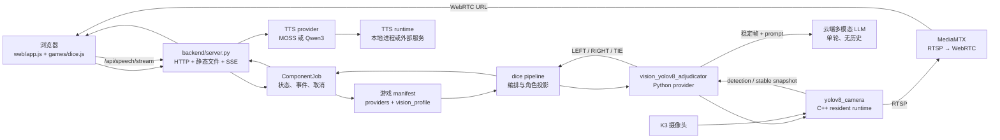

# Dice Arena 当前整体框架与调度说明

> 更新时间：2026-08-30
>
> 适用范围：当前 `main/` 仓库的 Web、Python HTTP bridge、可插拔组件、骰子视觉裁决和 TTS 调度。

这份文档回答“用户操作以后，数据经过哪些层、由谁负责决策、什么时候释放资源”。它描述当前已经存在的代码，不把机械臂、ROS2、WebSocket 或未来视觉定位器写成已实现功能。

## 1. 一眼看懂：端到端链路



部署上只有一个 Python HTTP 服务提供网页和 API；YOLO 与本地 TTS runtime 是由 provider 管理的独立进程。MediaMTX 是视频分发服务，不是裁决逻辑的一部分。

## 2. 目录职责

```text
main/
├── backend/
│   ├── server.py                         # HTTP bridge、静态文件、SSE、任务入口
│   ├── componentctl.py                   # provider 生命周期命令行管理
│   ├── core/
│   │   ├── components.py                 # 扫描 manifest、动态加载和职责校验
│   │   ├── games.py                      # 游戏 manifest 加载、校验和 provider 槽位解析
│   │   ├── jobs.py                       # 异步任务状态、结构化事件、取消
│   │   ├── vision.py                     # adjudicator/localizer 接口
│   │   ├── tts.py、tts_dispatch.py       # TTS 接口和选择调度
│   │   └── tts_protocol.py               # WAV 长度前缀流协议
│   ├── components/                       # 可插拔功能包，不按模型名称硬编码
│   │   ├── vision_yolov8_adjudicator/    # YOLOv8 视觉裁决 provider
│   │   ├── tts_moss_nano/                # MOSS-TTS-Nano provider
│   │   └── tts_qwen3/                    # Qwen3-TTS provider
│   └── games/
│       ├── dice/manifest.json            # 当前有效骰子配置和 vision_profile
│       └── dice/pipeline.py              # 视觉结果到角色结果的上层投影
├── vision/yolov8_adjudicator/            # K3 C++ runtime、模型和硬件默认配置
├── tts/                                  # TTS runtime 源码和板端交付资产
├── web/                                  # 浏览器 UI 和游戏状态机
├── scripts/                              # Web 服务启停（会调 componentctl）
├── deploy/                               # 可选 systemd 单元
└── docs/                                 # 当前文档索引、归档和历史设计记录
```

`build/`、`.shaders/`、`.runtime/`、`__pycache__/`、日志、PID、模型和板端依赖属于生成物或部署资产，由 `.gitignore` 排除。旧的 `backend/components/vision_yolo/` 不再是组件；仓库只保留 `vision_yolo → vision_yolov8_adjudicator` 的 registry 迁移别名。

## 3. 两类配置的边界

### 3.1 游戏 manifest：一局游戏的语义配置

以 [`backend/games/dice/manifest.json`](backend/games/dice/manifest.json) 为例：

```json
{
  "participants": {"player": "LEFT", "agent": "RIGHT"},
  "providers": {
    "vision_adjudicator": "vision_yolov8_adjudicator",
    "tts": "tts_moss_nano"
  },
  "vision_profile": {
    "vision": {"model": "...", "class_map": {}, "stable_frames": 30},
    "rule": {"kind": "numeric_compare", "aggregation": "sum"},
    "llm": {"timeout_seconds": 3, "allowed_outcomes": ["LEFT", "RIGHT", "TIE"]},
    "video": {"path": "/dice/"},
    "lifecycle": {"post_result_hold_seconds": 3},
    "timeouts": {"adjudication_seconds": 120}
  }
}
```

游戏 manifest 负责：

- 游戏是否启用、展示名称和前端播报文案；
- 语义 provider 槽位；
- 玩家与 Agent 到物理侧的映射；
- YOLO 类别如何解释、稳定帧数量、分组方式和规则；
- 单轮 LLM prompt、允许的结果和 LLM 超时；
- 视频 path、结果后的画面保持时长和整轮视觉超时。

`participants` 只供游戏 pipeline 和前端使用。视觉裁决器不读取玩家/Agent 身份，只返回物理侧 `LEFT`、`RIGHT` 或 `TIE`。

### 3.2 组件/runtime 配置：部署和实现细节

| 文件 | 所有者 | 典型字段 |
| --- | --- | --- |
| `backend/components/vision_yolov8_adjudicator/config.json` | Python provider | resident/per-request 模式、runtime 路径、LLM endpoint/model/key、生命周期宽限时间 |
| `vision/yolov8_adjudicator/config.json` | C++ runtime / 部署 | 摄像头、分辨率、推理线程、EP affinity、RTSP、MediaMTX `video.webrtc_base_url` |
| `backend/components/tts_*/config.json` | 各 TTS provider | 本地 runtime 路径、端口、模型和音色参数 |

视觉组件配置不重复保存摄像头、RTSP 或 WebRTC 基础地址。新增游戏只写自己的 `vision_profile.video.path`，例如 `/dice/` 或 `/rps/`。完整播放地址由基础地址和 path 安全拼接：

```text
游戏 manifest vision_profile.video.webrtc_base_url（可选）
    > vision/yolov8_adjudicator/config.json.video.webrtc_base_url
```

当前部署基础地址为 `http://100.118.229.28:8889`；骰子页面最终播放 `http://100.118.229.28:8889/dice/`。YOLO 发布的 RTSP 路径只供 MediaMTX 接管，浏览器不直接使用。

## 4. 服务启动时发生什么

1. `scripts/start_web.sh` 通过 `backend/componentctl.py selected tts` 读取当前游戏 manifest 的 `providers.tts`，骰子当前为 `tts_moss_nano`。
2. 脚本调用 `backend/componentctl.py start <provider>`。本地 TTS provider 启动自己的 runtime；云端 provider 可以没有 lifecycle 脚本。
3. 脚本启动 `backend/server.py --host 0.0.0.0 --port 8080`，并写入被忽略的 PID/日志文件。
4. `server.py` 扫描 `backend/components/*/manifest.json`，动态加载 provider。
5. `load_games()` 扫描 `backend/games/*/manifest.json`，校验 `participants`、`providers`、播报条目和内嵌 `vision_profile`。
6. 服务创建全局 `ComponentRegistry`、`GameRegistry`、job 表和单视觉任务锁。

新增 provider 或修改游戏 provider 后需要重启后端，让 registry 和 manifest 重新扫描。无需在 `server.py` 添加具体 provider 的 import。

## 5. 一轮视觉裁决的时序

### 5.1 创建任务

浏览器在“双方已开盖”后请求：

```http
POST /api/adjudicate
Content-Type: application/json

{"game":"dice"}
```

`server.py` 校验游戏并创建 `ComponentJob`，同时只允许一个 `queued` 或 `running` 视觉任务。请求立即返回 `202 + job_id`，前端随后连接 SSE。

### 5.2 provider 和 runtime

`games/dice/pipeline.py` 按以下顺序选择裁决器：

```text
DICE_VISION_ADJUDICATOR_PROVIDER
    > 兼容 DICE_VISION_PROVIDER
    > manifest.providers.vision_adjudicator
    > 兼容 manifest.providers.vision
    > vision_yolov8_adjudicator
```

随后构造 `VisionAdjudicationRequest`，把已校验的 profile 传给 `VisionAdjudicatorProvider.adjudicate()`。provider 解析组件 config 和 runtime config，按 profile 为每个视角启动或复用 `yolov8_camera`：

```text
build/yolov8_camera --config vision/yolov8_adjudicator/config.json \
  --no-display --control-fd <fd> --event-fd <fd> --prewarm \
  --snapshot-dir <本局私有目录> --view-id <view>
```

`--prewarm` 让摄像头、GStreamer 和 RTSP/MediaMTX 链路常驻。`config.json` 的 `yolov8_enabled=false` 只表示默认不主动推理；进程拥有控制通道时，收到 `START_ADJUDICATION` 才启用本局 YOLO 检测。

### 5.3 稳定帧、规则和 LLM

1. provider 向每个视角发送 `START_ADJUDICATION`。
2. runtime 通过独立 `event-fd` 输出 JSONL：`started`、`ready`、`video`、`phase`、`progress`、`observation`。stdout/stderr 仅作为诊断日志。
3. runtime 达到 profile 的稳定帧数量后输出一帧私有 snapshot 和通用 detection；黑线/divider 仅作为场景几何辅助信息。
4. provider 根据 `class_map`、participants、分组方式和 `rule` 计算每个视角的 YOLO 初判。多视角属于同一个裁决对象，按 profile 的 `majority_vote` 做多数投票。
5. 如果启用 LLM，provider 将稳定帧和本局 prompt 作为一次无历史的 OpenAI-compatible 多模态请求。LLM 只负责复核图片，不接收其他请求上下文。
6. 结果优先级：YOLO 与 LLM 一致使用 `consensus`；LLM 成功但不一致使用 `llm_override`；LLM 超时使用 `yolo_timeout_fallback`；其他无效响应或检测证据不足进入错误。
7. provider 发出 `FINAL_RESULT` 给 runtime，再发出 `STOP_ADJUDICATION`。这会立即停止 YOLO 推理，但 resident 摄像头和视频链路继续保持。
8. 发送 `result` 后进入 `holding`，等待 `lifecycle.post_result_hold_seconds`。保持期间不重新检测、不重复调用 LLM，只继续让前端观看实时画面；值为 `0` 时立即结束。
9. provider 发出 `complete`，任务变为 `success`，resident runtime 回到 `idle`；per-request 模式则回收进程和摄像头。

总视觉检测/LLM 预算由 `vision_profile.timeouts.adjudication_seconds` 控制，缺省回退全局 `DICE_JOB_TIMEOUT_SECONDS`（当前默认 120 秒）。LLM 自身的 `timeout_seconds`（骰子当前为 3 秒）受该预算约束；结果后的 holding 是展示生命周期，不用于延长检测或 LLM。

### 5.4 结果语义

视觉 provider 的物理结果示例：

```json
{
  "verified": true,
  "adjudicated": true,
  "winner": "RIGHT",
  "decision_source": "consensus",
  "verification": {"status": "matched", "yolo_winner": "RIGHT", "llm_winner": "RIGHT"}
}
```

骰子 pipeline 随后依据 manifest 的 `participants` 生成角色化字段，例如 `winner_role=agent`、`player_score` 和 `agent_score`。因此将玩家/Agent 换到另一侧只需改 manifest，不需要修改视觉功能包。

## 6. TTS 调度

TTS 与视觉一样使用职责接口和目录功能包：

```text
浏览器 speakState()
  → POST /api/speech/stream（game、key、values）
  → server.py 读取 manifest 文案
  → TtsDispatcher 按 game.providers.tts 选择 provider
  → provider.stream() / synthesize()
  → 长度前缀 WAV 帧
  → 浏览器按序播放
```

当前 provider：

| ID | 运行方式 | 地址/来源 | 流式粒度 |
| --- | --- | --- | --- |
| `tts_moss_nano` | 仓库内 Python bridge | `tts/moss-tts-nano`，默认端口 `18082` | 文本 chunk 完成后的完整 WAV 帧 |
| `tts_qwen3` | `llama-server` | `tts/qwen3-tts`，默认端口 `18080` | 自然标点切分后的完整 WAV 帧 |

两者都不是逐 PCM 帧真流式。普通新 TTS 只需继承 `core.tts.TtsProvider` 并实现 `health()`、`synthesize()`；需要更低延迟时再覆盖 `stream()`。本地包可以在组件 manifest 声明 lifecycle start/stop，云端包省略生命周期并在 `health()` 中检查远端。

## 7. API、事件和取消

| 方法 | 路径 | 作用 |
| --- | --- | --- |
| GET | `/api/health` | bridge、组件、视觉和当前 TTS 综合状态 |
| GET | `/api/components` | 已注册 provider 元数据和健康状态 |
| GET | `/api/games` | 浏览器安全的游戏 manifest（不含模型、prompt、密钥） |
| POST | `/api/speech/stream` | 按游戏台词键返回 WAV 帧流 |
| POST | `/api/tts/stream` | 直接提交文本返回 WAV 帧流 |
| POST | `/api/tts/synthesize` | 返回单个完整 WAV，适合诊断 |
| POST | `/api/adjudicate` | 创建视觉任务，返回 `job_id` |
| GET | `/api/adjudicate/<job_id>` | 查询完整任务快照 |
| GET | `/api/adjudicate/<job_id>/events` | 查询结构化事件 |
| GET | `/api/adjudicate/<job_id>/stream` | SSE 推送 snapshot/update/heartbeat/complete |
| POST | `/api/adjudicate/<job_id>/cancel` | 取消任务 |

任务状态为 `queued → running → success|error`；视觉阶段为 `starting → detecting → verifying → holding → complete`。取消、超时或 runtime 异常时，provider 发送 `CANCEL`，关闭管道并回收 per-request 进程；resident runtime 返回 idle。`/api/analyze...` 仅是旧客户端迁移别名。

## 8. 安全和边界

- LLM key 存放在 `backend/components/vision_yolov8_adjudicator/config.json` 的 `llm.api_key`（Git 跟踪文件，仓库须保持私有），不能写入前端、公开 manifest 或日志。当前工作区若有用户本地组件 config 修改，提交整理时必须跳过。
- profile 的模型路径、视频 path、snapshot path 都经过校验；视频 path 只能是安全 URL path，不能包含主机、query、fragment 或 `..`。
- provider 业务事件使用独立 JSONL 通道；不要从 stdout/stderr 的日志文本猜测胜负。
- 网页不生成随机结果；裁决必须来自 runtime detection 和 profile/provider 规则。
- 浏览器预览是 `getUserMedia()`，YOLO 读取的是 K3 摄像头；两者不是同一数据流。
- 当前没有机械臂、ROS2、WebSocket 或实际 `localizer` provider。未来定位器必须使用 `role=localizer` 和独立接口，不能接入 `vision_adjudicator`。

## 9. 验证入口

本地逻辑回归：

```bash
python3 -m pytest -q tests
python3 -m compileall -q backend
node --check web/app.js
node --check web/games/dice.js
git diff --check
```

K3 硬件验证必须在板端执行：

```bash
cd /home/spacemit/projects/dice-game/main
scripts/start_web.sh
curl -fsS http://127.0.0.1:8080/api/health
curl -fsS http://127.0.0.1:8080/api/components
curl -fsS http://127.0.0.1:8080/api/games
```

YOLO C++ 的 `--self-test`、短时 `--max-frames`、摄像头协商和 MediaMTX 在线状态需要有实际板端输出才能判定通过；本机编译或端口可访问不能替代硬件验证。
