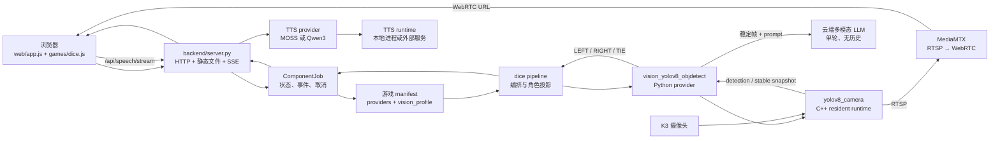
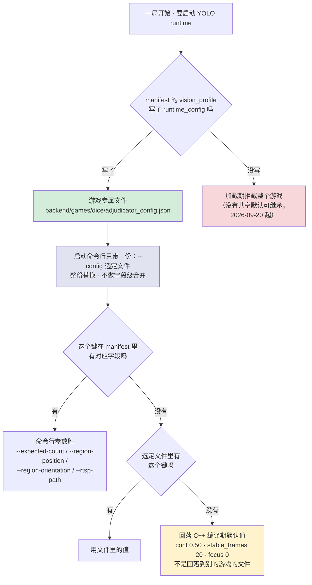

# Dice Arena 当前整体框架与调度说明

> 更新时间：2026-08-30
>
> 适用范围：当前 `main/` 仓库的 Web、Python HTTP bridge、可插拔组件、骰子视觉裁决和 TTS 调度。

这份文档回答“用户操作以后，数据经过哪些层、由谁负责决策、什么时候释放资源”。它描述当前已经存在的代码，不把机械臂、ROS2、WebSocket 或未来视觉定位器写成已实现功能。

## 1. 一眼看懂：端到端链路



部署上只有一个 Python HTTP 服务提供网页和 API；YOLO 与本地 TTS runtime 是由 provider 管理的独立进程。MediaMTX 是视频分发服务，不是裁决逻辑的一部分。

## 2. 目录职责

```text
main/
├── backend/
│   ├── server.py                         # HTTP bridge、静态文件、SSE、任务入口
│   ├── componentctl.py                   # provider 生命周期命令行管理
│   ├── core/
│   │   ├── components.py                 # 扫描 manifest、动态加载和职责校验
│   │   ├── games.py                      # 游戏 manifest 加载、校验和 provider 槽位解析
│   │   ├── jobs.py                       # 异步任务状态、结构化事件、取消
│   │   ├── vision.py                     # adjudicator/localizer 接口
│   │   ├── tts.py、tts_dispatch.py       # TTS 接口和选择调度
│   │   └── tts_protocol.py               # WAV 长度前缀流协议
│   ├── components/                       # 可插拔功能包，不按模型名称硬编码
│   │   ├── vision_yolov8_objdetect/    # YOLOv8 视觉裁决 provider
│   │   ├── tts_gptsovits/                # GPT-SoVITS 远程流式 provider（外部 GPU 主机）
│   │   ├── tts_moss_nano/                # MOSS-TTS-Nano provider
│   │   └── tts_qwen3/                    # Qwen3-TTS provider
│   └── games/
│       ├── dice/manifest.json            # 当前有效骰子配置和 vision_profile
│       └── dice/pipeline.py              # 视觉结果到角色结果的上层投影
├── vision/yolov8_objdetect/            # K3 C++ runtime、模型和硬件默认配置
├── tts/                                  # TTS runtime 源码和板端交付资产
├── web/                                  # 浏览器 UI 和游戏状态机
├── scripts/                              # Web 服务启停（会调 componentctl）
└── docs/                                 # 当前文档索引、归档和历史设计记录
```

`build/`、`.shaders/`、`.runtime/`、`__pycache__/`、日志、PID、模型和板端依赖属于生成物或部署资产，由 `.gitignore` 排除。旧的 `backend/components/vision_yolo/` 不再是组件；仓库只保留 `vision_yolo → vision_yolov8_objdetect` 的 registry 迁移别名。

## 3. 两类配置的边界

### 3.1 游戏 manifest：一局游戏的语义配置

以 [`backend/games/dice/manifest.json`](backend/games/dice/manifest.json) 为例（**节选**：略去 `state_machine` 与 `class_map` 明细，数值与文件同步，如有出入以文件为准）：

```jsonc
{
  // 槽位留空即继承 backend/config.json 的全局默认（dice 现在全部继承）
  "providers": {"vision_adjudicator": "vision_yolov8_objdetect"},
  "vision_profile": {
    "schema_version": 1,
    "game_id": "dice",
    "vision": {
      "class_map": {"0": "1", "...": "..."},   // 类别 ID→游戏值（Python 规则引擎消费）
      "participants": ["LEFT", "RIGHT"],
      "expected_count": 5,             // 每侧恰好 5 个才算稳定（provider 也要校验数量）
      "grouping": "divider_regions"     // 按分界线切分左右（Python region_split 消费）
    },
    // model / conf / stable_frames / divider_detection 已迁至本游戏
    // adjudicator_config.json（2026-09-20），见下节。
    "multi_view": {"enabled": true, "min_views": 1},
    "rule": {"kind": "numeric_compare"},
    "llm": {"enabled": false, "timeout_seconds": 10, "allowed_outcomes": ["LEFT", "RIGHT", "TIE"], "...": "..."},
    "video": {"enabled": false, "path": "/dice/det"},
    "lifecycle": {"pre_adjudication_wait_seconds": 3, "post_result_hold_seconds": 2},
    "timeouts": {"yolo_detection_seconds": 8, "adjudication_seconds": 30}
  }
}
```

> `participants`（玩家/Agent → 物理侧）是**部署属性**，dice 不写即继承全局 `backend/config.json`；只有需要为某个游戏单独换边时才在此声明。

游戏 manifest 负责：

- 游戏是否启用、展示名称和前端播报文案；
- 语义 provider 槽位；
- 玩家与 Agent 到物理侧的映射；
- YOLO 类别如何解释、稳定帧数量、分组方式和规则；
- 单轮 LLM prompt、允许的结果和 LLM 超时；
- 视频 path、结果后的画面保持时长和整轮视觉超时。

`participants` 只供游戏 pipeline 和前端使用。视觉裁决器不读取玩家/Agent 身份，只返回物理侧 `LEFT`、`RIGHT` 或 `TIE`。

### 3.2 组件/runtime 配置：部署和实现细节

| 文件 | 所有者 | 典型字段 |
| --- | --- | --- |
| `backend/components/vision_yolov8_objdetect/config.json` | Python provider | resident/per-request 模式、runtime 路径、生命周期宽限时间（**不含** LLM 凭证；2026-09-04 起 LLM 配置在 `backend/components/llm_openai_compat/config.json`） |
| `backend/components/llm_openai_compat/config.json` | LLM 组件 | endpoint、model、api_key、`reasoning_effort` 部署默认（Git 跟踪，**仓库须保持私有**） |
| `backend/games/<id>/adjudicator_config.json` | C++ runtime / **各游戏专属（必填）** | 摄像头、分辨率、帧率、推理线程、EP affinity、焦距/变焦、RTSP 地址、MediaMTX `video.webrtc_base_url`。**只放"这台板子+这张桌子"的属性**：检测阈值等游戏参数在游戏 manifest（见 §3.3）。共享部署默认 `vision/yolov8_objdetect/config.json` 已于 2026-09-20 删除 |
| `backend/components/tts_*/config.json` | 各 TTS provider | 本地 runtime 路径、端口、模型和音色参数 |

视觉组件配置不重复保存摄像头、RTSP 或 WebRTC 基础地址。新增游戏只写自己的 `vision_profile.video.path`，例如 `/dice/` 或 `/rps/`。完整播放地址由基础地址和 path 安全拼接：

```text
游戏 manifest vision_profile.video.webrtc_base_url（可选）
    > 该游戏 runtime_config 文件（如 backend/games/dice/adjudicator_config.json）的 video.webrtc_base_url
```

当前部署基础地址为 `http://127.0.0.1:8889`；骰子页面最终播放 `http://127.0.0.1:8889/dice/`。YOLO 发布的 RTSP 路径只供 MediaMTX 接管，浏览器不直接使用。

### 3.3 接入第二个视觉游戏（2026-09-15 起）

裁决参数**全部按游戏走 manifest**。硬件参数同样**每游戏一份**：在 `vision_profile.runtime_config`
指向该游戏专属的硬件配置文件（**必填**——共享部署默认已于 2026-09-20 删除，不写直接拒载）：

```jsonc
"vision_profile": {
  "game_id": "rps",
  "runtime_config": "backend/games/rps/adjudicator_config.json",   // 必填；该游戏唯一的硬件来源
  "vision": { "...": "..." }
}
```

**配置解析：单源 + 整份替换**

这一节回答两个**互相独立**的问题，混在一起最容易出错：

1. **读哪一份配置文件**——每个游戏一份、manifest 声明、必填；
2. **同一个键谁说了算**——命令行参数恒压过文件；文件里没有的键回落到 C++ 编译期默认值。



**两个反直觉点（都踩过）**：

- **缺键不回退到别的文件。** 每游戏一份、选定了就是**唯一**来源。
  所以"我只改一个值、其余继承"做不到，必须整份复制。以 `stable_frames` 为例：另一份文件写
  30、C++ 默认是 **20**——游戏那份里漏写它，拿到的是 20 而不是 30。
- **manifest 与 runtime 配置各管一半。** `model`/`conf`/`stable_frames`/`divider_detection`
  （C++ 消费的运行参数）住在各游戏的 `adjudicator_config.json`，**写回 manifest 会被校验器
  拒载**；`class_map`/`grouping`/`expected_count`（Python 规则引擎消费的游戏语义）留在
  manifest。命令行只再压一层：`--expected-count`/`--region-*`/`--rtsp-path` 由 manifest 生成，
  **无论哪份文件被读都会覆盖一次**。

**声明的路径是强制的**：解析或读取失败会**直接报错**（日志给出具体文件名），不会静默起
runtime——否则就是悄悄用了别的游戏的摄像头与 RTSP 设置。实测：把 `runtime_config` 指向不存在的
文件 → **不起 runtime**，日志 `ProfileError("unable to read vision runtime config: ...")`。

**dice 现状**：`runtime_config` 指向 `backend/games/dice/adjudicator_config.json`，配置文件里有
一个 `_note` 键说明整份替换语义（两个解析器都忽略未知键，已用真实二进制 self-test 验证）。
rps 的硬件文件已备好（1080p@30 广角）等视觉模型接回。

**改硬件参数时的落点**：

| 想改什么 | 改哪个文件 |
| --- | --- |
| dice 的摄像头/分辨率/帧率/焦距/变焦/EP 绑核/RTSP 端点 | `backend/games/dice/adjudicator_config.json` |
| rps 的这些参数 | `backend/games/rps/adjudicator_config.json`（视觉接入前暂存） |
| MediaMTX WebRTC 基址 | 各游戏 `adjudicator_config.json` 的 `video.webrtc_base_url`（要统一就逐份改） |

| 归属 | 字段 | 放哪 |
| --- | --- | --- |
| **游戏**（Python 框架消费） | `class_map`/规则/`grouping`/`divider*`/`expected_count`/`video.path`/prompt/超时/节奏 | 游戏 manifest 的 `vision_profile`（摄像头也可用 `multi_view.views[].camera` 按视角配） |
| **runtime 运行参数**（C++ 消费） | 模型（`model`，相对路径按配置文件所在目录解析）、检测阈值（`conf`）、稳定帧数（`stable_frames`）、分界线检测（`divider_detection`） | 该游戏自己的 `runtime_config` 文件（`backend/games/<id>/adjudicator_config.json`） |
| **硬件/部署**（每游戏一份，必填） | 摄像头设备、分辨率、帧率、EP 绑核、线程数、队列深度、焦距、变焦、RTSP host/port、WebRTC 基址 | 同上 |

接入清单：

| 步骤 | 位置 |
| --- | --- |
| 声明 `vision_profile`（`model`/`class_map`/规则/`stable_frames`/`confidence`/`grouping`/`video.path`/prompt） | `backend/games/<id>/manifest.json`（模型文件放 `backend/games/<id>/models/`） |
| 声明自己的硬件文件 `runtime_config`（必填） | 同上 + `backend/games/<id>/adjudicator_config.json` |
| 薄壳 pipeline（约 15 行）：调 `core.vision_pipeline.run_vision_game` 并传入自己的投影 | `backend/games/<id>/pipeline.py` |
| 结果投影：数值型参照 `games/dice/result.py`；类别型直接用 `core.participants.project_categorical_result` | 游戏自己的 result 模块 |
| 前端游戏模块（阶段文案/按键/渲染） | `web/games/<id>.js` + 在 `web/app.js` 注册 |

**`backend/core/` 无需改动。**

> 每游戏一份硬件文件里的 `model` 字段是**相对该配置文件所在目录**解析的（C++ 行为）。生产不受影响
> （provider 永远传 `--model` 绝对路径覆盖它），但**手工直接跑那个二进制时要留意**。

**★ 签名契约（必须理解）**：resident runtime 的缓存键是 `view_id`，而每个游戏的单视图
profile 都用 `"default"`——所以 `_runtime_signature()`（`provider.py`）是**唯一**把两个游戏
区分开的东西。它必须覆盖每个会改变 runtime 行为的 profile 字段（`game_id`、`model`、
`stable_frames`、`confidence`、`divider_detection`、`expected_count`、解析后的
`region_position`/`region_orientation`、`grouping`、`video.path`、`camera`、profile 的
`runtime` 块），**外加运行时配置文件的解析路径与其 `mtime_ns`+`size`**。漏掉任何一项，第二个
游戏就会复用上一个游戏的进程，带着错的分界线门控/每侧数量/RTSP 挂载点运行。

**共用摄像头下的取舍**：两个游戏共用同一个 `/dev/video1`，因此**不允许双 runtime 共存**
（会抢设备）。缓存键坚持 `view_id`、签名变化即"拆旧建新"，切换游戏必然重建一次
（付摄像头打开 + 模型加载）。这是设计选择，不是缺陷。要支持双游戏同时常驻，前提是
各自有独立摄像头设备。

## 4. 服务启动时发生什么

1. `scripts/start_web.sh` 通过 `backend/componentctl.py referenced tts` 收集当前游戏 manifest 引用到的全部 TTS provider（本地槽 `providers.tts_local`、远程槽 `providers.tts_remote` 与台词级 `provider` 覆盖），骰子当前为 `tts_moss_nano` + `tts_gptsovits`，逐个启动。
2. 脚本调用 `backend/componentctl.py start <provider>`。本地 TTS provider 启动自己的 runtime；云端 provider 可以没有 lifecycle 脚本。
3. 脚本启动 `backend/server.py --host 0.0.0.0 --port 8080`，并写入被忽略的 PID/日志文件。
4. `server.py` 扫描 `backend/components/*/manifest.json`，动态加载 provider。
5. `load_games()` 扫描 `backend/games/*/manifest.json`，校验 `participants`、`providers`、播报条目和内嵌 `vision_profile`。
6. 服务创建全局 `ComponentRegistry`、`GameRegistry`、job 表和单视觉任务锁。

新增 provider 或修改游戏 provider 后需要重启后端，让 registry 和 manifest 重新扫描。无需在 `server.py` 添加具体 provider 的 import。

## 4.5 一局游戏的权威状态机时序（2026-09-02 起）

一局 = 一个 round（`/api/game/rounds`）。后端 `GameRound` 按 manifest `state_machine`
驱动全部流程，前端只提交意图并渲染事件：

```text
POST /api/game/rounds                    创建 round（自动取消残留活动 round）
  └─ state_changed(rules) + speech 指令   → 前端拉帧播放（/rounds/<id>/speech）
POST /rounds/<id>/intents {"intent":...}  按键意图（confirm/start_shake/stop_shake/retry/…）
POST /rounds/<id>/intents {"intent":"speech_done","directive_id":...}  await 台词播完回执
GET  /rounds/<id>/stream                 SSE：state_changed/speech/tick/裁决事件透传/complete
```

意图、计时器到期与裁决事件并发时由引擎的 generation 计数保证先到先赢；`await` 台词
30 秒无回执自动兜底推进。`/api/adjudicate` 保留为独立调试入口（同一 provider 管线）。

## 5. 一轮视觉裁决的时序

### 5.1 创建任务

浏览器在“双方已开盖”后请求：

```http
POST /api/adjudicate
Content-Type: application/json

{"game":"dice"}
```

`server.py` 校验游戏并创建 `ComponentJob`，同时只允许一个 `queued` 或 `running` 视觉任务。请求立即返回 `202 + job_id`，前端随后连接 SSE。（正常游戏流程中该步骤由状态机的
`adjudicate` 动作经 `run_game` 桥接发起，本节描述的 job 语义不变。）

### 5.2 provider 和 runtime

`core/vision_pipeline.py` 的 `run_vision_game()` 按以下顺序选择裁决器（游戏薄壳 pipeline 只传
自己的 `game_id` 与结果投影）：

```text
游戏 manifest  providers.vision_adjudicator      ← 规范槽位
    > 兼容别名   providers.vision
    > 全局       backend/config.json 的 providers.vision_adjudicator / .vision
                 （run_game 用 with_global_defaults 垫在游戏 manifest 之下，逐键游戏优先）
    > 兜底       vision_yolov8_objdetect
```

> 环境变量覆盖层（`DICE_VISION_ADJUDICATOR_PROVIDER` / `DICE_VISION_PROVIDER`）**已于
> 2026-09-02 整体移除**，JSON 是唯一配置来源。

随后构造 `VisionAdjudicationRequest`，把已校验的 profile 传给 `VisionAdjudicatorProvider.adjudicate()`。
provider 解析**该游戏的** runtime 配置（见 §3.3）和组件 config，按 profile 为每个视角启动或复用
`yolov8_camera`：

```text
build/yolov8_camera --config <该游戏的 runtime 配置> \
  --no-display --control-fd <fd> --event-fd <fd> --view-id <view> \
  --snapshot-dir <本局私有目录> [--prewarm] \
  --model <绝对路径> --stable-frames <n> --conf <阈值> \
  [--divider-detection] [--expected-count <n>] [--region-position/-orientation ...] \
  --rtsp-path <video.path>
```

**摄像头以外的硬件项（分辨率/帧率/EP 绑核/焦距/变焦/RTSP host+port/WebRTC 基址）只来自那份
runtime 配置**，没有命令行转发——这也是它们必须写在配置文件里、而 `model`/`stable_frames`/`conf`/
`divider_detection`/`rtsp.path` 写在配置文件里是死键的原因（§3.3）。

`--prewarm` 让摄像头、GStreamer 和 RTSP/MediaMTX 链路先起来。runtime config 的 `yolov8_enabled=false`
只表示默认不主动推理；进程拥有控制通道时，收到 `START_ADJUDICATION` 才启用本局 YOLO 检测。

**runtime 的生命周期：`vision_always_on`（`backend/config.json`，缺省 `true`）**

先说清它**不**负责什么：多个游戏共用同一个摄像头/裁决器（单机位时 `view_id` 都是 `"default"`），
靠的是 provider 的 `view_id` 缓存 + `_runtime_signature()`（§3.3 的签名契约）——**每个 `view_id`
任何时刻只有一个 runtime**，切换游戏就是"拆旧建新"。这个开关不参与那件事，它只决定**回合结束后
这条流是留着还是放掉**。

| 值 | 行为 | 空闲时的代价 |
| --- | --- | --- |
| `true`（缺省） | 不武装拆除者，跨回合、跨游戏常驻到进程退出 | 摄像头一直被占；常驻约 **0.4 核 / RSS 262 MiB** |
| `false` | 跟随游戏生命周期：回合进入终态（`exited`/`cancelled`/`error`）即停流、释放摄像头 | 每回合重建一次 |

**两种情况下的启动时机是相同的**：进入游戏（`create_round`）就一定以 `--prewarm` 拉起 Camera +
RTSP，检测器会话一并载入，只是不推理。所以 `false` 的代价**不在裁决那一刻**，而在进游戏那一刻。

**这个代价实测为 1.44 秒**（板端，进游戏 → 模型加载 + 摄像头打开完成；启动序列是
`Model loaded` → `GStreamer camera opened` → `RTSP publishing`）。它藏在开场语音 + 三二一开盖
倒计时（十几秒）之后，**玩家看不到**。用 1.44 秒换"不用时立刻释放摄像头"通常更划算。

**什么时候才该用 `true`**：空闲时也需要摄像头画面——例如机械臂标定/取点想随时看画面而不必先开一局，
或挂一个常驻监控页。没有这类需求就设 `false`。

**⚠️ `true` 模式下不要手工 `kill` 常驻 runtime**：provider 的 `_ensure_runtime()` 只查缓存与签名、
**不验活**，被外部杀掉的进程会在缓存里留下死句柄，下一局复用它并报 "not running"。要清就重启服务。
`false` 模式没有这个隐患（每回合自然重建）。

**热加载**：每回合开始时读取（日志里 `stream up for round ... (vision_always_on=...)` 即当回合取值），
改完保存即生效，不必重启；`true→false` 从下一局结束起生效，`false→true` 从下一局开始起生效。
它是**全局**开关，游戏 manifest 不参与。

### 5.3 稳定帧、规则和 LLM

1. provider 向每个视角发送 `START_ADJUDICATION`。
2. runtime 通过独立 `event-fd` 输出 JSONL：`started`、`ready`、`video`、`phase`、`progress`、`observation`。stdout/stderr 仅作为诊断日志。
3. runtime 的 `stable_count` 只累计**本局 profile 能裁决的帧**，一帧要同时满足三条才累加，否则清零：开启 `divider_detection` 时该帧定位到分界线；按该帧**定位到的分界线**切分（定位不到时才回落到 `vision.divider.position`/`orientation`）后两侧各恰好 `vision.expected_count` 个目标；两侧类别多重集与上一帧完全一致。达到 `stable_frames` 后输出一帧私有 snapshot 和通用 detection。数量与分区位置由 `process.py` 转发为 `--expected-count/--region-position/--region-orientation`，runtime 不固化游戏规则；profile 未声明 `expected_count` 时只保留"检测非空 + 分界线已定位"的旧判据。因此遮挡、叠放、漏检会让计数停在低位，等满 `yolo_detection_seconds` 后走失败诊断，而不是先凑出稳定观测再被 provider 的数量校验打回。
4. provider 根据 `class_map`、participants、分组方式和 `rule` 计算每个视角的 YOLO 初判。多视角属于同一个裁决对象，按 profile 的 `majority_vote` 做多数投票。
5. 如果启用 LLM 复核（`llm.enabled`），provider 将稳定帧和本局 prompt 作为一次无历史的 OpenAI-compatible 多模态请求。LLM 只负责复核图片，不接收其他请求上下文。`llm.reasoning_effort`（`none`/`low`/`high`/`max`，热加载）逐局指定思考深度：`none` 关闭模型思考模式，实测复核从 5–10s 降到 1–4s；缺省时用 LLM 组件 config 的部署默认（未设置 = 端点默认，通常是 high）。**失败诊断与复核无关**（2026-09-14 起）：等不到稳定观测、或稳定观测的每侧数量不符时，原因由本地规则依据检测证据（每侧数量、分界线、是否检测为空）生成，不发任何多模态请求。
6. 结果优先级：YOLO 与 LLM 一致使用 `consensus`；不一致时对 LLM 复问一次做佐证——复问与 YOLO 一致用 `yolo_reask_confirmed`，复问仍坚持且非平局才用 `llm_override`（平局是算术事实，`tie_upheld` 永不被推翻），复问无定论用 `yolo_reask_fallback`；LLM 超时使用 `yolo_timeout_fallback`；其他无效响应或检测证据不足进入错误。
7. provider 发出 `FINAL_RESULT` 给 runtime，再发出 `STOP_ADJUDICATION`。这会立即停止 YOLO 推理，但 resident 摄像头和视频链路继续保持。
8. 发送 `result` 后进入 `holding`，等待 `lifecycle.post_result_hold_seconds`。保持期间不重新检测、不重复调用 LLM，只继续让前端观看实时画面；值为 `0` 时立即结束。
9. provider 发出 `complete`，任务变为 `success`，resident runtime 回到 `idle`；per-request 模式则回收进程和摄像头。

总视觉检测/LLM 预算由 `vision_profile.timeouts.adjudication_seconds` 控制，缺省回退全局 `DICE_JOB_TIMEOUT_SECONDS`（当前默认 120 秒）。稳定观测预算由 `timeouts.yolo_detection_seconds` 单独限制（骰子当前 8 秒），必须容得下 `stable_frames` 个有效帧——分界线缺席的帧不计入，故不能按帧率理论值掐时间。LLM 自身的 `timeout_seconds`（骰子当前为 3 秒）受该预算约束；结果后的 holding 是展示生命周期，不用于延长检测或 LLM。

### 5.4 结果语义

视觉 provider 的物理结果示例：

```json
{
  "verified": true,
  "adjudicated": true,
  "winner": "RIGHT",
  "decision_source": "consensus",
  "verification": {"status": "matched", "yolo_winner": "RIGHT", "llm_winner": "RIGHT"}
}
```

骰子 pipeline 随后依据 manifest 的 `participants` 生成角色化字段，例如 `winner_role=agent`、`player_score` 和 `agent_score`。因此将玩家/Agent 换到另一侧只需改 manifest，不需要修改视觉功能包。

## 6. TTS 调度

TTS 与视觉一样使用职责接口和目录功能包：

```text
浏览器 speakState()
  → POST /api/speech/stream（game、key、values）
  → server.py 读取 manifest 文案
  → TtsDispatcher 按 game.providers.tts 选择 provider
  → provider.stream() / synthesize()
  → 长度前缀 WAV 帧
  → 浏览器按序播放
```

当前 provider：

| ID | 运行方式 | 地址/来源 | 流式粒度 |
| --- | --- | --- | --- |
| `tts_moss_nano` | 仓库内 Python bridge | `tts/moss-tts-nano`，默认端口 `18082` | 文本 chunk 完成后的完整 WAV 帧 |
| `tts_qwen3` | `llama-server` | `tts/qwen3-tts`，默认端口 `18080` | 自然标点切分后的完整 WAV 帧 |
| `tts_gptsovits` | 外部 GPT-SoVITS 服务（Tailscale） | `config.json` 的 `runtime.base_url` 单点配置，无本地 lifecycle | 流式 PCM 块实时包装为完整 WAV 帧 |

两者都不是逐 PCM 帧真流式。普通新 TTS 只需继承 `core.tts.TtsProvider` 并实现 `health()`、`synthesize()`；需要更低延迟时再覆盖 `stream()`。本地包可以在组件 manifest 声明 lifecycle start/stop，云端包省略生命周期并在 `health()` 中检查远端。

## 7. API、事件和取消

| 方法 | 路径 | 作用 |
| --- | --- | --- |
| GET | `/api/health` | bridge、组件、视觉和当前 TTS 综合状态 |
| GET | `/api/components` | 已注册 provider 元数据和健康状态 |
| GET | `/api/games` | 浏览器安全的游戏 manifest（不含模型、prompt、密钥） |
| POST | `/api/speech/stream` | 按游戏台词键返回 WAV 帧流 |
| POST | `/api/tts/stream` | 直接提交文本返回 WAV 帧流 |
| POST | `/api/tts/synthesize` | 返回单个完整 WAV，适合诊断 |
| POST | `/api/adjudicate` | 创建视觉任务，返回 `job_id` |
| GET | `/api/adjudicate/<job_id>` | 查询完整任务快照 |
| GET | `/api/adjudicate/<job_id>/events` | 查询结构化事件 |
| GET | `/api/adjudicate/<job_id>/stream` | SSE 推送 snapshot/update/heartbeat/complete |
| POST | `/api/adjudicate/<job_id>/cancel` | 取消任务 |

任务状态为 `queued → running → success|error`；视觉阶段为 `starting → detecting → verifying → holding → complete`。取消、超时或 runtime 异常时，provider 发送 `CANCEL`，关闭管道并回收 per-request 进程；resident runtime 返回 idle。`/api/analyze...` 仅是旧客户端迁移别名。

## 8. 安全和边界

- LLM key 存放在 `backend/components/llm_openai_compat/config.json` 的顶层 `api_key`（该文件扁平结构，**没有** `llm` 子段；2026-09-04 大模型模块化后从视觉组件迁出。Git 跟踪文件，仓库须保持私有），不能写入前端、公开 manifest 或日志。当前工作区若有用户本地组件 config 修改，提交整理时必须跳过。
- profile 的模型路径、视频 path、snapshot path 都经过校验；视频 path 只能是安全 URL path，不能包含主机、query、fragment 或 `..`。
- provider 业务事件使用独立 JSONL 通道；不要从 stdout/stderr 的日志文本猜测胜负。
- 网页不生成随机结果；裁决必须来自 runtime detection 和 profile/provider 规则。
- 浏览器预览是 `getUserMedia()`，YOLO 读取的是 K3 摄像头；两者不是同一数据流。
- 当前没有机械臂、ROS2、WebSocket 或实际 `localizer` provider。未来定位器必须使用 `role=localizer` 和独立接口，不能接入 `vision_adjudicator`。

## 9. 验证入口

本地逻辑回归：

```bash
python3 -m pytest -q tests
python3 -m compileall -q backend
node --check web/app.js
node --check web/games/dice.js
git diff --check
```

K3 硬件验证必须在板端执行：

```bash
cd /home/spacemit/projects/dice-game/main
scripts/start_web.sh
curl -fsS http://127.0.0.1:8080/api/health
curl -fsS http://127.0.0.1:8080/api/components
curl -fsS http://127.0.0.1:8080/api/games
```

YOLO C++ 的 `--self-test`、短时 `--max-frames`、摄像头协商和 MediaMTX 在线状态需要有实际板端输出才能判定通过；本机编译或端口可访问不能替代硬件验证。
