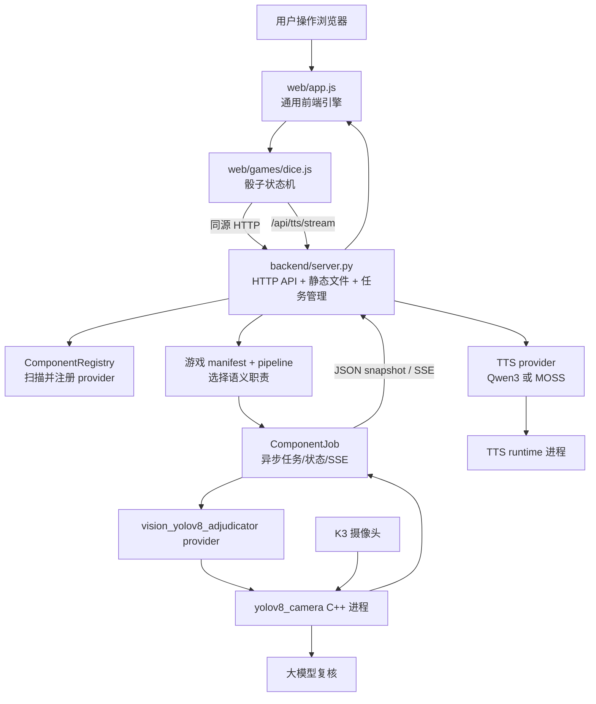
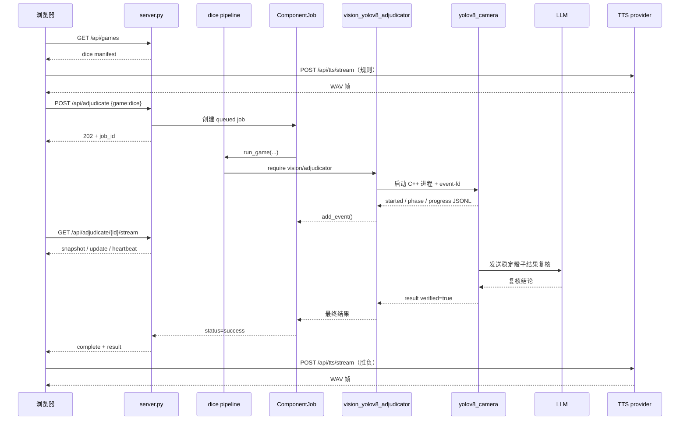

# Dice Arena 当前整体框架与调度说明

> 文档状态：基于当前工作区代码整理
>
> 更新时间：2026-08-28
>
> 适用范围：`main/` 项目当前已经实现的 Web、HTTP bridge、组件注册、YOLOv8 视觉裁决和 TTS 调度。

## 1. 这份文档解决什么问题

这不是使用手册，也不是未来机械臂方案设计，而是当前项目的“调度视图”：

- 用户点击网页按钮后，事件如何在前端状态机中流转；
- 后端如何把 HTTP 请求转换成游戏任务；
- 游戏如何选择视觉和 TTS provider；
- YOLOv8 子进程如何被启动、读取和终止；
- 结构化事件、诊断日志、最终结果分别通过什么通道传递；
- 当前代码已经实现到哪里，哪些内容仍然只是未来接口边界。

阅读本文件时，建议同时打开以下入口文件：

- [前端通用引擎](/home/fitz/spacemit-k3-dev/projects/dice-game/main/web/app.js)
- [骰子游戏模块](/home/fitz/spacemit-k3-dev/projects/dice-game/main/web/games/dice.js)
- [HTTP bridge](/home/fitz/spacemit-k3-dev/projects/dice-game/main/backend/server.py)
- [组件注册表](/home/fitz/spacemit-k3-dev/projects/dice-game/main/backend/core/components.py)
- [游戏注册与流水线调度](/home/fitz/spacemit-k3-dev/projects/dice-game/main/backend/core/games.py)
- [骰子流水线](/home/fitz/spacemit-k3-dev/projects/dice-game/main/backend/games/dice/pipeline.py)
- [异步任务对象](/home/fitz/spacemit-k3-dev/projects/dice-game/main/backend/core/jobs.py)

---

## 2. `AI_PROJECT_CONTEXT.md` 是什么文件

`AI_PROJECT_CONTEXT.md` 是项目交接上下文文件，面向后续 AI、开发者和维护人员，不是程序运行时必需的配置文件。

它的主要作用是记录：

1. 项目当前目标和已实现范围；
2. 本地开发机路径与 K3 板端真实路径的关系；
3. 当前目录结构、启动方式和 API；
4. 前端状态机、视觉裁决、TTS 调用链；
5. 密钥、并发、CPU/EP 亲和性等不能随意破坏的约束；
6. 当前没有实现的能力，例如机械臂、ROS2、WebSocket 和浏览器端随机判胜；
7. 后续接入机械臂时建议保留的接口边界。

可以把它理解为“给新 AI 或新开发者看的项目记忆和交接说明”。它与 `README.md` 的区别是：

| 文件 | 主要读者 | 主要内容 | 是否参与程序运行 |
|---|---|---|---|
| `README.md` | 使用者、部署者 | 如何启动、如何调用、如何验证 | 否 |
| `AI_PROJECT_CONTEXT.md` | 接手项目的 AI、架构维护者 | 当前架构、历史迁移背景、边界和注意事项 | 否 |
| `CLAUDE.md` | 编程代理 | 修改代码时必须遵守的工程约束 | 否 |
| `FRAMEWORK_DISPATCH.md` | 想理解调度流程的人 | 当前代码的端到端调度图和接口关系 | 否 |

因此，`AI_PROJECT_CONTEXT.md` 不应被当作 Python 配置、环境变量文件或部署脚本；修改它不会改变服务行为。

---

## 3. 系统总览

当前系统是一个“同源 Web + Python HTTP bridge + 板端模型进程”的架构。



### 3.1 部署关系

- `web/` 和 `backend/server.py` 由同一个 Python HTTP 服务提供，因此前端和 API 是同源访问。
- `vision_yolov8_adjudicator` 默认持有 resident runtime：摄像头和 MediaMTX 视频链路
  预热后保持 idle，收到 `START_ADJUDICATION` 才计稳定帧；结果保持时间结束后回到
  idle，异常或取消才释放 runtime。
- TTS 是独立的板端运行时：Qwen3 使用 `llama-server`，MOSS 使用仓库内的 Python HTTP bridge。
- 浏览器摄像头只用于页面预览；实际骰子识别读取 K3 板端摄像头。

### 3.2 当前不属于系统的内容

以下内容在当前代码中没有真正接入：

- 机械臂控制；
- ROS2 topic、service 或 action；
- WebSocket；
- 浏览器端随机生成骰子并判胜；
- 视觉定位器（`localizer`）的实际 provider。

---

## 4. 目录与职责

```text
main/
├── web/                         # 浏览器端 UI、通用引擎、各游戏状态机
│   ├── app.js                   # 游戏列表、通用状态、TTS、HTTP、SSE
│   └── games/dice.js            # 摇骰子状态机和结果显示
├── backend/
│   ├── server.py                # HTTP bridge、静态文件、任务路由
│   ├── core/
│   │   ├── components.py        # provider 自动发现和注册
│   │   ├── games.py             # 游戏 manifest 和 pipeline 调度
│   │   ├── jobs.py              # 异步任务状态、事件、取消
│   │   ├── tts.py               # TTS provider 接口
│   │   ├── vision.py            # 视觉 adjudicator/localizer 接口
│   │   └── errors.py            # 标准化错误类型和错误码
│   ├── components/
│   │   ├── vision_yolov8_adjudicator/ # 通用 YOLOv8 视觉裁决功能包
│   │   ├── tts_qwen3/           # Qwen3-TTS 适配器
│   │   └── tts_moss_nano/       # MOSS-TTS-Nano 适配器和 bridge
│   └── games/dice/
│       ├── manifest.json        # 游戏文案、provider、视觉裁决 profile、音视频参数
│       └── pipeline.py          # 将 dice 游戏请求交给 adjudicator
├── vision/yolov8_objdetect/     # K3 YOLOv8 C++ 工程和模型配置
├── tts/qwen3-tts/               # Qwen3 runtime、模型配置、启动脚本
├── tts/moss-tts-nano/           # MOSS runtime 源码和板端交付目录
├── scripts/                     # Web/TTS 启停脚本
└── deploy/                      # 可选 systemd 服务文件
```

---

## 5. 服务启动时的调度

后端进程启动时，`backend/server.py` 按以下顺序初始化：

1. 计算项目根目录和 `web/` 路径；
2. 调用 `load_board_env()`，读取板端本地 `.dice-arena.env` 和环境变量；
3. 读取 `DICE_JOB_TIMEOUT_SECONDS`，作为未配置游戏 profile 时的视觉任务默认超时（120 秒）；
4. 调用 `build_registry()`，扫描 `backend/components/*/manifest.json`；
5. 动态加载每个 manifest 中的 `entry`，实例化 provider，并校验类型、角色和接口；
6. 调用 `load_games()`，扫描 `backend/games/*/manifest.json`，并校验其中可选的 `vision_profile`；
7. 创建全局 `COMPONENTS`、`GAMES`、`jobs` 和单任务锁 `active_job_id`；
8. 启动 `ThreadingHTTPServer`，同时提供静态网页和 `/api/*`。

### 5.1 组件自动发现

组件至少包含：

```text
manifest.json       # id/type/role/enabled/entry 等声明
provider.py         # Component 子类
```

例如当前注册结果：

```text
tts_moss_nano  -> type=tts
tts_qwen3      -> type=tts
vision_yolov8_adjudicator -> type=vision, role=adjudicator
```

`build_registry()` 不在 `server.py` 中硬编码导入具体 provider，而是根据 manifest 动态加载入口类。因此增加或删除一个组件，原则上只需要增加或删除对应组件目录，并重启后端重新扫描。

### 5.2 类型和职责校验

视觉组件不能只声明 `type=vision`，还必须声明职责：

- `role=adjudicator`：输出游戏胜负裁决，必须实现 `adjudicate()`；
- `role=localizer`：输出目标坐标，必须实现 `locate()`。

这条边界防止“同样使用 YOLO”被误认为“可以互换”。坐标定位器不能被接入骰子胜负裁决槽位。

---

## 6. 前端调度：从页面操作到状态机

通用引擎在 `web/app.js`，具体骰子逻辑在 `web/games/dice.js`。页面不直接写死后端 provider，也不自己生成判定结果。

### 6.1 页面状态流

```text
select
  → rules
  → ready
  → countdown
  → shaking
  → open
  → analysis
  → result
  → ready / select
```

### 6.2 各状态的调度动作

| 阶段 | 触发方式 | 前端动作 | 后端动作 |
|---|---|---|---|
| `select` | 页面加载 | 请求 `/api/games`，显示可用游戏 | 返回所有游戏 manifest 的公开字段 |
| `rules` | 进入「摇骰子」 | 播报 `rules_intro` | 调用 `/api/speech/stream`，按台词模式选择 TTS/WAV |
| `ready` | 确认规则 | 等待用户开始 | 无视觉任务 |
| `countdown` | 点击开始或停止 | 本地倒计时 | 当前没有机械臂指令 |
| `shaking` | 倒计时完成 | 显示摇骰动画和 8 秒计时 | 当前没有机械臂指令 |
| `open` | 停止倒计时完成 | 等待「双方已开盖」 | 当前没有视觉任务 |
| `analysis` | 点击「双方已开盖」 | 创建 job，连接 SSE，显示分析进度 | 启动 YOLOv8 子进程 |
| `result` | job 成功 | 渲染双方骰子、总和、胜负并播报 | 返回 `verified` 结果 |

当前三个按钮只是未来机械臂动作的占位：

- `startShake`：现在只切换前端倒计时；未来可下发机械臂摇骰动作；
- `stopShake`：现在只结束前端计时；未来可停止机械臂动作；
- `revealDice`：现在由用户确认开盖后创建视觉任务；未来可由机械臂开盖完成事件触发。

### 6.3 前端如何接收分析进度

进入 `analysis` 后，骰子模块执行：

1. `POST /api/adjudicate`，请求体默认为 `{ "game": "dice" }`；
2. 服务返回 `job_id` 和初始快照；
3. 优先打开 `GET /api/adjudicate/<job_id>/stream`；
4. 如果浏览器不支持 SSE 或连接中断，回退到约 700 ms 一次的快照轮询；
5. 收到 `success` 且存在结果后，切换到 `result`；
6. 出错时显示错误信息，并显示「重新分析」按钮。

前端只消费结构化字段，例如 `phase`、`stable_count`、`stable_frames` 和 `result`，不会解析 YOLO 的 stdout 文本来推断胜负。

---

## 7. 后端调度：HTTP 请求如何进入游戏流水线

### 7.1 启动裁决任务

请求：

```http
POST /api/adjudicate
Content-Type: application/json

{"game":"dice"}
```

`server.py` 的处理过程：

1. 解析 JSON；没有 `game` 时默认使用 `dice`；
2. `create_adjudication_job(game_id)` 校验游戏存在且已启用；
3. 检查全局 `active_job_id`，如果已有 `queued` 或 `running` 任务，返回 `JOB_ALREADY_EXISTS`；
4. 创建 `ComponentJob`；
5. 在线程中运行 `run_game(...)`；
6. 立即返回 HTTP 202 和 job 初始快照。

### 7.2 游戏流水线如何选 provider

`backend/core/games.py` 负责通用游戏加载，`backend/games/dice/pipeline.py` 负责骰子游戏的实际编排。

骰子流水线选择视觉裁决器的逻辑是：

```text
请求/环境覆盖
  ↓
游戏 manifest.providers.vision_adjudicator
  ↓
默认 vision_yolov8_adjudicator
```

具体来说，`resolve_provider_id()` 会按以下优先级查找：

1. `DICE_VISION_ADJUDICATOR_PROVIDER`；
2. 兼容旧配置的 `DICE_VISION_PROVIDER`；
3. manifest 中的 `providers.vision_adjudicator`；
4. 兼容旧 manifest 的 `providers.vision`；
5. 流水线传入的默认值 `vision_yolov8_adjudicator`。

然后通过：

```python
components.require(
    provider_id,
    expected_type="vision",
    expected_role="adjudicator",
)
```

取得 provider，并调用它的 `adjudicate()`。

TTS 的选择规则与视觉 provider 相同；请求体中的 `provider` 仅兼容保留，不参与后端选择：

```text
DICE_TTS_PROVIDER
  ↓
当前游戏 providers.tts
  ↓
默认 tts_qwen3
```

正常网页请求只发送 `game`、`text`、`voice` 和 `speed`，不会让浏览器决定真正的 provider。

---

## 8. `ComponentJob` 任务生命周期

`backend/core/jobs.py` 是所有异步视觉任务共用的任务容器。

### 8.1 状态和阶段

任务状态：

```text
queued → running → success
                 ↘ error
```

公开阶段：

```text
queued → starting → detecting → verifying → complete
                                      ↘ error
```

`status` 表示任务生命周期，`phase` 表示视觉流程阶段，两者不是同一个字段。

### 8.2 任务内部保存的内容

每个 job 保存：

- `job_id`：随机生成的任务 ID；
- `status`、`phase`、`error`；
- `result`：最终业务结果；
- `logs`：最近的人工诊断日志；
- `events`：最近的结构化事件；
- `event_sequence`：事件单调递增序号；
- `revision`：状态、阶段或事件变化版本号；
- `started_at`、`finished_at`；
- `cancelled`：是否收到取消请求。

诊断日志和业务事件是两条有意分离的通道：

- 日志用于板端控制台和任务快照排障；
- 事件用于网页进度和最终结果；
- 任意 JSON-looking 日志不会自动成为业务结果。

### 8.3 取消和并发

请求：

```http
POST /api/adjudicate/<job_id>/cancel
```

取消时，`ComponentJob.cancel()` 会在锁内原子地设置 `_cancelled` 并把任务置为 `error`。视觉 provider 在循环中检查 `is_cancelled()`，终止 YOLO 进程并抛出取消错误。

后端当前只允许一个活动裁决任务，目的是避免多个 YOLO 进程同时争用：

- K3 摄像头；
- TCM / 内存资源；
- SpaceMIT 推理算力；
- LLM 请求和输出通道。

---

## 9. YOLOv8 视觉裁决调度

### 9.1 Provider 负责什么

`backend/components/vision_yolov8_adjudicator/provider.py` 是通用 Python 适配器，负责：

- 定位 `vision/yolov8_objdetect/build/yolov8_camera`；
- 检查可执行文件和 LLM 配置；
- 探测二进制是否支持 `--event-fd`；
- 启动 C++ 子进程；
- 读取结构化事件管道；
- 读取 stdout/stderr 诊断日志；
- 响应取消和超时；
- 回收进程；
- 返回最终 `verified` 裁决结果。

旧组件 ID `vision_yolo` 仅由 `ComponentRegistry` 解析为新 ID，并记录一次迁移日志；
旧目录不再被扫描或注册。游戏配置应使用 `vision_yolov8_adjudicator`。

### 9.2 当前子进程启动方式

典型命令等价于：

```bash
vision/yolov8_objdetect/build/yolov8_camera \
  --config config.json \
  --no-display \
  --rejudge-on-change \
  --event-fd <pipe-fd>
```

工作目录是 `vision/yolov8_objdetect/`。如果旧版二进制不支持 `--event-fd`，provider 会退回兼容模式，只识别明确标记的 `[RESULT] {...}` 行；普通 stdout/stderr 仍然只作为日志。

### 9.3 事件和日志通道

当前优先使用独立 JSONL 管道：

```text
C++ stdout/stderr ─────────────→ diagnostic logs
C++ --event-fd JSONL ──────────→ ComponentJob.events ─→ SSE/API
```

典型结构化事件包括：

```json
{"event":"started","phase":"starting"}
{"event":"phase","phase":"detecting"}
{"event":"progress","stable_count":3,"stable_frames":5}
{"event":"phase","phase":"verifying"}
{"event":"result","verified":true,"winner":"LEFT", ...}
```

网页不需要知道 C++ 的日志格式；只要事件字段稳定，底层实现可以继续替换。

### 9.4 有效结果条件

当前网页胜负路径要求视觉组件返回经过验证的业务结果。典型约束包括：

- 左右两侧都识别到 5 颗骰子；
- 检测结果满足稳定帧要求；
- YOLOv8 计算出双方点数和；
- LLM 复核成功，或代码明确允许的受控超时回退路径；成功但不一致时以 LLM 为准；
- 最终结果包含 `verified: true`。

识别失败、数量不符、超时、LLM 配置缺失或进程异常退出时（LLM 超时回退除外），任务进入 `error`，网页不会使用随机骰子兜底。

---

## 10. SSE 和查询接口

### 10.1 任务快照

```http
GET /api/adjudicate/<job_id>
```

返回完整快照，适合兼容客户端轮询或最终确认。

### 10.2 结构化事件查询

```http
GET /api/adjudicate/<job_id>/events
```

只返回事件列表、事件序号、任务状态和 revision，不包含完整诊断日志。

### 10.3 SSE 推送

```http
GET /api/adjudicate/<job_id>/stream
```

事件类型：

- `snapshot`：连接建立时发送完整快照；
- `update`：任务有新状态、阶段或事件时发送增量；
- `heartbeat`：15 秒内没有变化时发送保活；
- `complete`：任务成功或失败时发送最终增量。

SSE 的增量通过 `revision` 和 `event_sequence` 去重，避免每次重新发送全部历史日志和事件。

---

## 11. TTS 调度

### 11.1 前端调用

游戏文案来自 `backend/games/dice/manifest.json`，例如 `rules_intro`、`shake_started`、`result_player_win`。前端只传状态键和动态值，由后端按台词模式选择 TTS 或已有 WAV：

```http
POST /api/speech/stream
Content-Type: application/json

{
  "game": "dice",
  "key": "result_player_win",
  "values": {"player_score": 18, "agent_score": 12}
}
```

台词条目使用 `{"mode":"tts","text":"..."}` 或
`{"mode":"audio","audio":"audio/rules_intro.wav"}`；旧的纯字符串仍视为
TTS，音频文件第一版仅支持游戏目录内的 WAV。

前端不调用浏览器 `speechSynthesis` 作为隐藏式兜底；当前 provider 不可用时会显示错误提示。

### 11.2 Provider 接口

所有 TTS provider 继承 `TtsProvider`：

- 必须实现 `synthesize(payload)`，返回一个完整 WAV；
- 可以覆盖 `stream(payload, write_frame)`，返回多个 WAV 帧；
- 基类默认把一个完整 WAV 包装成单帧流。

因此新增普通 TTS 模型时，不需要修改 `server.py` 或前端。

### 11.3 当前两个 TTS provider

| Provider | 运行时 | 地址 | 当前流式粒度 |
|---|---|---|---|
| `tts_qwen3` | `llama-server` + Qwen3-TTS | `127.0.0.1:18080` | 自然标点分段后的完整 WAV 帧 |
| `tts_moss_nano` | 仓库内 MOSS Python bridge | `127.0.0.1:18082` | 文本 chunk 完成后的完整 WAV 帧 |

两者都不是逐 PCM 或逐 codec 帧的真流式；网页可以在第一段完整 WAV 生成后开始播放，后续帧继续读取。

### 11.4 WAV 帧协议

`/api/tts/stream` 的响应类型是 `application/x-dice-arena-wav-stream`。响应体由以下帧组成：

```text
4 字节大端长度 N
N 字节 WAV 数据
```

特殊帧：

- 长度 `0`：正常结束；
- 长度 `0xffffffff`：错误帧，后跟 4 字节错误消息长度和 UTF-8 错误消息。

浏览器端 `readTtsFrames()` 解析协议，`createTtsFrameQueue()` 让网络读取和音频播放并行进行。

### 11.5 TTS 生命周期

`scripts/start_web.sh` 会根据：

1. `DICE_TTS_PROVIDER`；
2. `backend/games/dice/manifest.json` 的 `providers.tts`；
3. 默认 `tts_qwen3`；

选择 provider，并调用 `backend/componentctl.py start ...`。provider 的 manifest 可以声明 `lifecycle.start` 和 `lifecycle.stop`，因此运行时启停逻辑也属于组件自身。

---

## 12. 公开 API 总表

| 方法 | 路径 | 作用 |
|---|---|---|
| GET | `/api/health` | bridge、组件、视觉裁决器、LLM 和当前 TTS 的综合健康状态 |
| GET | `/api/tts/health` | 当前或指定 TTS provider 的健康状态 |
| GET | `/api/components` | 所有已注册组件及其健康信息 |
| GET | `/api/games` | 所有游戏 manifest |
| POST | `/api/speech/stream` | 按 manifest 台词键选择 TTS 或 WAV，返回长度前缀 WAV 帧流 |
| POST | `/api/tts/stream` | 单次请求返回长度前缀的 WAV 帧流 |
| POST | `/api/tts/synthesize` | 返回一个完整 WAV，适合手工调试 |
| POST | `/api/adjudicate` | 创建一次视觉裁决任务，返回 HTTP 202 |
| GET | `/api/adjudicate/<job_id>` | 查询完整任务快照 |
| GET | `/api/adjudicate/<job_id>/events` | 查询结构化事件 |
| GET | `/api/adjudicate/<job_id>/stream` | SSE 推送任务变化 |
| POST | `/api/adjudicate/<job_id>/cancel` | 取消任务 |
| POST/GET | `/api/analyze...` | 旧客户端迁移别名，内部仍走 adjudication |

静态资源路径由同一个服务处理，例如 `/` 对应 `web/index.html`。静态文件服务会检查解析后的路径必须位于 `web/` 内，避免路径逃逸。

---

## 13. 错误、超时和保护机制

### 13.1 标准错误

后端使用 `backend/core/errors.py` 中的类型化错误，并转换为 JSON 响应。常见类别包括：

- 游戏不存在或已禁用；
- provider 不存在、类型不匹配或角色不匹配；
- 请求 JSON 无效或正文过大；
- TTS 参数无效或运行时不可用；
- 视觉进程不存在、退出异常或超时；
- job 不存在、已有任务运行或任务被取消。

### 13.2 进程回收

视觉 provider 使用独立进程组启动 YOLOv8。取消、超时、检测到最终结果或服务异常时，会尝试：

1. 发送 `SIGTERM`；
2. 等待最多 5 秒；
3. 仍未退出时发送 `SIGKILL`；
4. 关闭事件管道和 selector。

### 13.3 密钥边界

LLM key 应通过 `.dice-arena.env` 或环境变量提供，不写入网页、不返回 API、不提交 Git。`vision/yolov8_objdetect/config.json` 中的本地密钥修改属于板端本地配置，操作时不能覆盖或提交。

---

## 14. 配置如何影响调度

### 游戏配置

[dice manifest](/home/fitz/spacemit-k3-dev/projects/dice-game/main/backend/games/dice/manifest.json) 负责：

- 游戏是否启用；
- 游戏名、图标和描述；
- 语义 provider 槽位；
- TTS 默认音色和语速；
- 各状态播报文案。

### 组件配置

- [Qwen3 配置](/home/fitz/spacemit-k3-dev/projects/dice-game/main/backend/components/tts_qwen3/config.json)：runtime 路径、端口、speaker 文件、生成参数；
- [MOSS 配置](/home/fitz/spacemit-k3-dev/projects/dice-game/main/backend/components/tts_moss_nano/config.json)：runtime 路径、模型目录、音色模式、端口和 SpaceMIT EP 参数；
- [YOLO 配置](/home/fitz/spacemit-k3-dev/projects/dice-game/main/vision/yolov8_objdetect/config.json)：摄像头、模型、稳定帧、LLM 和 EP 配置。

修改 manifest 或组件配置后，通常需要重启后端或对应 runtime，才能重新扫描或重新加载配置。

---

## 15. 当前一局骰子游戏的完整时序



---

## 16. 运行和检查建议

### 启动 Web

在 K3 板端项目根目录执行：

```bash
scripts/start_web.sh
```

默认地址：

```text
http://127.0.0.1:8080
```

### 检查组件和服务

```bash
python3 backend/componentctl.py list
python3 backend/componentctl.py health tts_qwen3
python3 backend/componentctl.py health tts_moss_nano
curl -fsS http://127.0.0.1:8080/api/health
curl -fsS http://127.0.0.1:8080/api/components
curl -fsS http://127.0.0.1:8080/api/games
```

### 手工调试 TTS

```bash
curl -f http://127.0.0.1:8080/api/tts/synthesize \
  -H 'Content-Type: application/json' \
  -d '{"text":"骰子游戏开始。","voice":"default","speed":1.0}' \
  -o /tmp/dice-arena.wav
file /tmp/dice-arena.wav
```

### 检查视觉任务

```bash
curl -fsS -X POST http://127.0.0.1:8080/api/adjudicate \
  -H 'Content-Type: application/json' \
  -d '{"game":"dice"}'
```

拿到 `job_id` 后，可查询：

```bash
curl -fsS http://127.0.0.1:8080/api/adjudicate/<job_id>
curl -fsS http://127.0.0.1:8080/api/adjudicate/<job_id>/events
curl -N http://127.0.0.1:8080/api/adjudicate/<job_id>/stream
```

完整摄像头、OpenCL、SpaceMIT EP 和 LLM 验证必须在 K3 板端进行；开发机沙箱不能代表板端硬件运行状态。

---

## 17. 当前验证状态和阅读时的注意点

当前工作区的 Python 组件测试能够覆盖 provider 注册、job 生命周期、TTS 配置和结构化事件等逻辑；HTTP API 测试需要创建本地监听 socket，受当前受限沙箱权限影响时可能无法启动。

TTS 功能包现在各自拥有独立的 `config.json` 和 `settings.py`。新增本地或云端 provider 时，
只需增加 `backend/components/tts_<name>/` 的 manifest/config/provider；本地包可选声明
生命周期脚本，云端包省略 lifecycle，由 provider 自己检查远端 health。无需修改
`backend/server.py`、`web/app.js` 或 `backend/core/tts_dispatch.py`。

---

## 18. 未来机械臂接入时，哪些边界应保持不变

未来可以把现在的人手按钮替换成 ROS2 或 Agent 事件，但建议保持以下权责：

- 前端继续负责展示和用户确认，不直接控制模型进程；
- 后端继续作为权威状态源；
- 游戏 pipeline 继续按语义职责选择 provider；
- `vision/adjudicator` 继续只负责骰子胜负裁决；
- 未来空间坐标能力使用独立的 `vision/localizer`；
- 视觉结果继续通过结构化事件和结果对象传递；
- 不让 ROS2、视觉实现和网页 UI 互相硬编码耦合。

推荐的未来映射是：

```text
startShake  → 机械臂摇骰 Action
stopShake   → 机械臂停止/收尾 Action
revealDice  → 机械臂开盖完成事件
analysis    → 后端创建视觉 adjudication job
result      → 后端权威结果 + 前端展示
```

这意味着未来主要替换的是“动作来源”和“事件来源”，不是重写当前游戏状态机、provider 接口或 job/SSE 协议。

---

## 19. 一句话总结

当前 Dice Arena 的核心调度链是：

```text
浏览器状态机
  → HTTP bridge
  → 游戏 manifest 选择语义 provider
  → ComponentJob 管理一次异步任务
  → vision_yolov8_adjudicator 调度 YOLOv8 runtime + LLM 复核
  → 结构化事件/SSE 返回网页
  → TTS provider 负责状态播报
```

其中 `AI_PROJECT_CONTEXT.md` 是帮助人和 AI 理解这条链路及其边界的交接记忆文件；`FRAMEWORK_DISPATCH.md` 则专门把“当前代码到底如何调度”按端到端流程展开。
