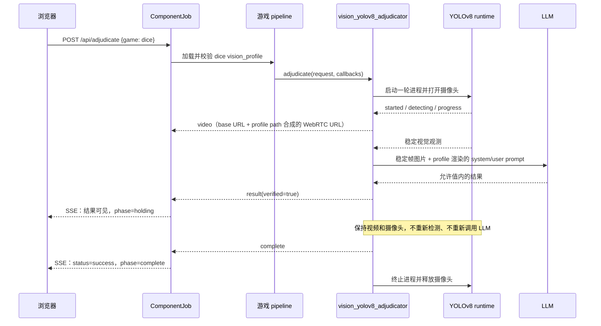

# vision_yolov8_adjudicator 架构重构设计

> 设计日期：2026-08-29  
> 设计状态：待用户审查  
> 适用范围：视觉裁决器、骰子游戏视觉 profile、任务生命周期和前端实时画面保持  
> 选择方案：方案 3——默认按局启动和结束，支持配置为常驻模式

## 1. 背景与问题

当前视觉能力分散在三个位置：

1. `backend/components/vision_yolo/provider.py` 同时负责进程管理、摄像头启动、事件协议兼容、超时、取消和结果解析；
2. `vision/yolov8_objdetect/src/` 的 C++ runtime 还直接包含骰子分区、5 + 5 数量校验、点数求和、胜负比较和骰子专属 LLM prompt；
3. `backend/games/dice/pipeline.py` 只传递一组通用回调，没有把本局游戏 profile、模型和规则明确传给视觉模块。

这种结构可以运行骰子，但新增猜拳或其他视觉游戏时，通常需要复制 provider、修改 C++ 业务逻辑或在后端增加硬编码。视觉模块也无法表达「结果已经得到，但实时视频还需要继续显示一段时间」这一生命周期。

本设计把视觉模块收敛为一个深模块（deep module）：调用者只知道「按一个 profile 启动一次裁决并接收结构化事件」，模型、摄像头、稳定帧、LLM 和进程回收等复杂性都隐藏在模块内部。

## 2. 目标与非目标

### 2.1 目标

- 将组件重命名为 `vision_yolov8_adjudicator`，名称表达「YOLOv8 实现的视觉裁决职责」，而不是骰子业务。
- 视觉组件只负责采集、推理、稳定帧、证据聚合、LLM 复核、生命周期和统一结果输出。
- 游戏规则、类别映射、参与方、prompt 和结果允许值全部由 `backend/games/<game_id>/vision_profile.json` 声明。
- 新增一个使用本地模型、远程模型或云端 LLM 的游戏时，只增加游戏 profile 和资源，不修改视觉组件核心调度。
- 所有游戏统一消费同一种 YOLO detection 输入，并输出同一种 adjudication result 外壳；不允许每个游戏自行定义一套 runtime 事件格式。
- 默认按局启动、按局释放摄像头；通过配置支持常驻进程复用。
- YOLO 稳定帧数量保持不变：每局达到稳定条件后，从稳定帧中选取一帧画面，连同 profile 渲染后的 system prompt 和 user prompt 一起发送给云端或本地的视觉大模型；每局最多调用一次 LLM，结果只发送一次。
- 增加 `post_result_hold_seconds`，让已发送结果后的实时画面继续显示；值为 `0` 时保持现有的立即关闭行为。
- 让任务状态、SSE 事件和前端视频生命周期一致，避免结果出现后连接或视频提前关闭。
- 保留一段迁移期的 `vision_yolo` 兼容别名，避免旧 manifest 或旧客户端突然失效。

### 2.2 非目标

- 本次设计不接入机械臂、ROS2、WebSocket 或新的视频传输协议。
- 不在浏览器端计算胜负，也不保留随机结果兜底。
- 不把未来的目标坐标定位器塞入裁决器接口；定位器继续使用独立的 `VisionLocalizerProvider`。
- 不让 HTTP 请求体覆盖模型路径、规则、prompt、LLM key 或保持时间；请求只选择游戏和本局标识。
- 不把 CMake、自测和硬件诊断能力当成面向用户的 CLI。C++ 可执行文件是 provider 的私有 runtime，不能成为前端或游戏的调用接口。

## 3. 设计决策摘要

| 决策 | 结论 | 原因 |
| --- | --- | --- |
| 组件 ID | `vision_yolov8_adjudicator` | 体现实现技术和职责，去掉 `dice` 业务耦合 |
| 外部接口 | `VisionAdjudicationRequest` + 结构化事件回调 | 调用方不需要知道 YOLO 进程参数 |
| 规则位置 | `backend/games/<game_id>/vision_profile.json` | 游戏变化不影响视觉组件 |
| 通用配置位置 | 组件包自己的 `config.json` | 摄像头、runtime 和生命周期只维护一份默认值 |
| 默认生命周期 | `per_request` | 摄像头资源安全释放，按局边界清晰 |
| 可选生命周期 | `resident` | 需要低延迟连续多局时复用进程 |
| 结果后的画面 | `holding` 阶段 | 结果可立即展示，同时不提前释放视频 |
| 事件协议 | `jsonl-events-v1` | stdout/stderr 只保留诊断用途，业务事件可测试 |
| 视频播放地址 | 游戏 `vision_profile.json` | 每个游戏可绑定自己的 MediaMTX WebRTC 地址 |
| LLM 复核输入 | 稳定帧图片 + profile prompt | 视觉大模型 API 收到一张稳定画面和一组游戏问题 |
| C++ 业务边界 | 输出通用视觉观测，Python 按 profile 聚合和裁决 | 新增游戏不需要改 C++ 核心 |

## 4. 目标目录结构与职责

```text
backend/
├── core/
│   ├── vision.py                       # 视觉职责接口和请求/事件类型
│   ├── jobs.py                         # queued/running/holding/success/error 生命周期
│   └── games.py                        # 加载游戏 manifest 和 vision profile
├── components/
│   └── vision_yolov8_adjudicator/
│       ├── manifest.json                # id/type/role/entry/capabilities
│       ├── config.json                  # 通用 runtime、摄像头、事件和默认生命周期
│       ├── provider.py                  # 对外 adapter；不含具体游戏规则
│       ├── process.py                   # 私有子进程、管道、超时和回收
│       ├── profile.py                   # profile 加载、校验和安全路径解析
│       ├── rules.py                     # 已声明规则类型的聚合和裁决
│       └── README.md                    # 功能包使用和配置说明
└── games/
    ├── dice/
    │   ├── manifest.json
    │   └── vision_profile.json          # 骰子模型、类别、数量、求和和 prompt
    └── rps/
        └── vision_profile.json          # 将来启用猜拳时只需增加该文件和模型

vision/yolov8_objdetect/
├── src/                                 # 私有 YOLOv8 摄像头 runtime
├── models/                              # 模型资产
├── config.json                          # 迁移期兼容配置；最终由组件配置生成/传入
└── CMakeLists.txt                       # 板端构建和硬件自测
```

组件包中的文件职责必须保持单一：`provider.py` 组合内部模块，`process.py` 只管进程和事件管道，`profile.py` 只管配置，`rules.py` 只管规则。任何文件都不能通过导入骰子 pipeline 来获取业务信息。

## 5. 统一接口

### 5.1 请求接口

`backend/core/vision.py` 增加一个不包含骰子字段的请求对象。概念接口如下：

```python
@dataclass(frozen=True)
class VisionAdjudicationRequest:
    game_id: str
    profile: Mapping[str, Any]
    request_id: str
    timeout_seconds: float
```

`VisionAdjudicatorProvider` 的唯一业务入口调整为：

```python
def adjudicate(
    self,
    request: VisionAdjudicationRequest,
    *,
    on_log: Callable[[str], None],
    on_event: Callable[[dict[str, Any]], None],
    is_cancelled: Callable[[], bool],
) -> dict[str, Any]:
    ...
```

约束如下：

- `game_id` 用于日志、审计和选择 profile，不用于在 provider 内写 `if game_id == "dice"`；
- `profile` 是由后端从受信任的游戏目录加载并校验后的只读数据；客户端不能提交或覆盖它；
- `request_id` 用于关联事件和日志，不承担业务规则；
- 超时由后端给出一个总预算，provider 内部必须把它同时应用于进程和 LLM 请求；
- provider 只返回统一结果，不返回进程对象、摄像头句柄或 C++ 私有结构体。

`VisionLocalizerProvider.locate()` 保持独立，不得实现或复用 `adjudicate()` 的胜负语义。

### 5.2 结果接口

新接口的稳定结果采用通用外壳：

```json
{
  "verified": true,
  "outcome": {
    "kind": "winner",
    "value": "LEFT"
  },
  "evidence": {
    "observations": [],
    "rule": "numeric_compare"
  },
  "profile_id": "dice",
  "provider_id": "vision_yolov8_adjudicator"
}
```

骰子迁移期可以在同一结果中保留 `left_sum`、`right_sum`、`left_values` 和 `right_values` 等兼容字段，但这些字段由骰子 profile 的结果投影层产生，不能出现在核心接口定义中。LLM 的原始文本永远不能直接作为最终结果；必须解析为允许值、通过 profile 规则校验，并在无法校验时返回错误。

## 6. 配置分层与优先级

### 6.1 组件通用配置

`backend/components/vision_yolov8_adjudicator/config.json` 负责所有游戏共享的运行参数。示例：

```json
{
  "schema_version": 1,
  "runtime": {
    "binary": "vision/yolov8_objdetect/build/yolov8_camera",
    "working_dir": "vision/yolov8_objdetect",
    "mode": "per_request",
    "request_timeout_seconds": 120,
    "terminate_grace_seconds": 5,
    "post_result_hold_seconds": 0
  },
  "camera": {
    "device": "/dev/video1",
    "width": 1280,
    "height": 720,
    "fps": 25
  },
  "events": {
    "protocol": "jsonl-events-v1"
  },
  "mediamtx": {
    "webrtc_base_url": "http://100.118.229.28:8889"
  }
}
```

`mode` 只允许 `per_request` 或 `resident`。模型路径、LLM endpoint、类别映射和游戏规则不放在这里。`mediamtx.webrtc_base_url` 是板端部署级基础地址，只配置协议、主机和端口，不包含游戏 stream path。

### 6.2 游戏视觉 profile

`backend/games/<game_id>/vision_profile.json` 负责游戏差异。骰子 profile 的完整字段约定如下：

```json
{
  "schema_version": 1,
  "game_id": "dice",
  "vision": {
    "model": "vision/yolov8_objdetect/models/best.q.onnx",
    "class_map": {
      "0": "1",
      "1": "2",
      "2": "3",
      "3": "4",
      "4": "5",
      "5": "6"
    },
    "participants": ["LEFT", "RIGHT"],
    "expected_count": 5,
    "stable_frames": 30,
    "rejudge_on_change": true,
    "grouping": "divider_regions"
  },
  "rule": {
    "kind": "numeric_compare",
    "aggregation": "sum",
    "higher_wins": true,
    "tie_value": "TIE"
  },
  "llm": {
    "enabled": true,
    "transport": "openai_compatible",
    "input_mode": "stable_frame_and_prompt",
    "image_source": "stable_frame",
    "url": "https://api.deepseek.com/v1/",
    "model": "deepseek-v4-flash-vision-exp",
    "timeout_seconds": 3,
    "system_prompt": "You are a strict game adjudicator. Use only supplied evidence.",
    "user_prompt_template": "Compare the supplied participant evidence and return one allowed outcome.",
    "allowed_outcomes": ["LEFT", "RIGHT", "TIE"]
  },
  "video": {
    "enabled": true,
    "protocol": "webrtc",
    "path": "/dice/",
    "autoplay": true,
    "muted": true
  },
  "lifecycle": {
    "post_result_hold_seconds": 3
  }
}
```

`video.path` 是该游戏对应的 MediaMTX WebRTC 播放 path；不同游戏使用不同路径，例如骰子使用 `/dice/`，猜拳使用 `/rps/`。它不用于配置或推导 RTSP 路径。`autoplay` 和 `muted` 只描述前端播放策略，不改变视觉裁决逻辑。

后端使用标准 URL 拼接规则，把组件配置中的 `mediamtx.webrtc_base_url` 和游戏 profile 中的 `video.path` 合成为完整播放地址，例如 `http://100.118.229.28:8889` + `/dice/` 得到 `http://100.118.229.28:8889/dice/`。禁止直接进行字符串相加，必须规范化基础地址末尾和 path 开头的 `/`，并保留 path 的结尾 `/`。

MediaMTX 的职责是接收 YOLOv8 runtime 输出的本地 RTSP，再提供 WebRTC 播放端点。视觉 provider 不把 RTSP 地址当作前端地址，也不在每局重复启动 MediaMTX；它只在 profile 校验通过后把合成的播放 URL 作为事件发给前端。MediaMTX 必须由板端部署或系统服务预先运行，路径不可用时由前端显示视频不可用，但不能影响已经完成的结构化裁决结果。

猜拳 profile 使用同一结构，但 `class_map` 和规则不同，例如：

```json
{
  "rule": {
    "kind": "categorical_relation",
    "relations": {
      "rock": "scissors",
      "scissors": "paper",
      "paper": "rock"
    }
  }
}
```

新增游戏时只替换模型文件和 `vision_profile.json` 中的输入解释、规则及输出约束。已有声明式规则能够表达的游戏不得修改 `provider.py`、C++ runtime 或游戏 pipeline；若未来确实出现当前规则 schema 无法表达的玩法，应先扩展通用规则解释器及其 schema，而不是增加 `if game_id` 分支或复制整个 provider。

### 6.3 配置优先级和安全边界

有效配置按以下顺序合并：

```text
受限环境变量覆盖
  > 游戏 vision_profile.json
  > 视觉组件 config.json
  > 代码中的安全默认值
```

环境变量只允许覆盖部署相关字段，例如二进制路径、摄像头设备、LLM key 和 endpoint。HTTP 请求不得覆盖任何模型、prompt、规则和保持时间。

所有 repository-relative 路径都以项目根目录解析，并拒绝绝对路径和解析后逃逸项目根目录的 `..` 路径。profile 加载时必须校验：文件存在、JSON 是对象、`schema_version` 受支持、`stable_frames` 为正整数、`post_result_hold_seconds` 为有限的非负数且不超过 300 秒、LLM allowed outcomes 非空且无重复值。

LLM key 只从 `DICE_LLM_API_KEY` 或不纳入 Git 的 `.dice-arena.env` 读取；任何 profile 和事件都不能保存或回传 key。

## 7. 调度和生命周期

### 7.1 按局模式（默认）



默认时序是：启动进程 → 稳定帧 → LLM 复核 → 立即发送 `verified` 结果 → 进入 `holding` → 等待保持时间 → 发送 `complete` → 回收进程和摄像头。`post_result_hold_seconds = 0` 时跳过等待，结果事件后立即完成回收。

### 7.2 常驻模式

常驻模式不是把一次性函数简单地改成不退出，而是一个带会话边界的内部 worker：

```text
启动一次 runtime 和摄像头
  → idle
  → 接收一个 profile 裁决请求
  → detecting / verifying / holding
  → complete
  → 清理本局内存和事件
  → idle，等待下一局
```

常驻模式必须保证：

- 同一时间最多一个活动裁决；已有活动任务时新请求返回 `JOB_ALREADY_EXISTS`；
- 每局使用独立的 profile 快照，不允许上一局的规则、观测或 LLM 结果泄漏到下一局；
- profile 切换时重新加载模型；同一模型可以复用已加载资源；
- 取消和超时能中断当前会话并回到可恢复的 `idle`，不能留下占用摄像头的孤儿进程；
- runtime 异常退出时，当前 job 失败，下一局可以重新拉起 worker；
- `holding` 只属于当前 job，结束后才允许接收下一局。

## 8. 结果保持与任务状态

### 8.1 状态定义

任务状态仍使用 `queued`、`running`、`success`、`error`；`phase` 扩展为：

```text
queued → starting → detecting → verifying → holding → complete
                                      └──────→ error
```

`holding` 不是新的终态，`status` 仍为 `running`。只有保持时间结束且 provider 完成资源释放后，任务才进入 `status=success, phase=complete`。

### 8.2 关键不变量

- `result(verified=true)` 代表「裁决结果已经得到」，不代表「视觉资源已经释放」；
- 结果事件发送一次，`holding` 期间不得重新检测或再次调用 LLM；
- SSE 在 `holding` 期间保持连接，前端可以同时显示结果和实时画面；
- 取消在 `holding` 期间仍然有效，立即终止进程并将 job 置为 `error`，不发送 success；
- 超时覆盖整个任务预算，包括保持时间；保持时间过长不能绕过任务总超时；
- provider 异常、进程非零退出、事件 JSON 无效或 profile 校验失败都不能生成成功结果。

### 8.3 事件协议

继续使用独立 event FD 的 `jsonl-events-v1`。stdout/stderr 只输出诊断日志。最小事件序列如下：

```json
{"event":"started","phase":"starting"}
{"event":"phase","phase":"detecting"}
{"event":"progress","phase":"detecting","stable_count":12,"stable_frames":30}
{"event":"phase","phase":"verifying"}
{"event":"result","verified":true,"outcome":{"kind":"winner","value":"LEFT"},"evidence":{}}
{"event":"phase","phase":"holding","remaining_ms":2500}
{"event":"complete","phase":"complete"}
```

`remaining_ms` 至少每 250 ms 或在数值变化时发送一次，以便前端显示剩余保持时间；保持时间为 `0` 时不发送 holding 延时事件。事件必须包含单调递增的 `sequence` 和服务端时间戳，避免 SSE 重连后重复渲染。

`ComponentJob` 需要删除「收到 verified result 就立即把 phase 改成 complete」的隐式规则，改为由显式 `phase=holding` 和 `complete` 事件驱动。旧 provider 返回结果但没有 complete 事件时，迁移适配器负责补发 complete，不能让新状态机依赖 stdout。

## 9. 前端实时画面与 MediaMTX

当前前端硬编码 `http://100.118.229.28:8889/dice/`，这会把部署地址和骰子路径一起写进 UI。新设计把 MediaMTX 基础地址放在组件 / 部署配置，把游戏 path 放在游戏 profile，再由后端合成完整 URL 并通过事件下发：

1. 组件配置声明部署级基础地址：

   ```json
   "mediamtx": {
     "webrtc_base_url": "http://100.118.229.28:8889"
   }
   ```

2. 游戏 profile 只声明自己的 WebRTC path：

   ```json
   "video": {
     "enabled": true,
     "protocol": "webrtc",
     "path": "/dice/"
   }
   ```

3. provider 在进程启动并确认两层配置有效后发送一次 `video` 事件：

   ```json
    {
      "event": "video",
      "url": "http://100.118.229.28:8889/dice/",
      "protocol": "webrtc",
      "game_id": "dice",
      "source": "mediamtx-base-plus-game-path"
    }
   ```

4. 基础地址和 path 只来自后端加载并校验的配置，HTTP 请求体不能提交、替换或拼接视频地址；
5. 前端继续使用现有 `iframe` 加载 MediaMTX 自带的 WebRTC 播放页面，不引入额外 WHEP JavaScript 播放器。收到 `video` 事件后设置 iframe source，并附加现有的 `autoplay=1`、`muted=1`、`controls=0` 和 `playsinline=1`；
6. 收到 `result` 时只更新结果，不清除视频；
7. 收到 `complete` 或任务错误时才停止/清除视频；
8. SSE 重连时根据快照中的最近 `video`、`result` 和 `phase` 恢复画面，不依赖事件恰好只到达一次；
9. profile 未启用视频时不发送 `video` 事件，前端隐藏视频区域，但裁决流程保持不变。

MediaMTX 的运行链路在本设计中视为外部基础设施，视觉组件不管理 RTSP 发布细节。对本项目而言，浏览器只接收最终 WebRTC 地址：

```text
K3 摄像头 → YOLOv8 / MediaMTX（外部 RTSP 接管细节）
                              ↓
组件 mediamtx.webrtc_base_url + 游戏 profile.video.path
                              ↓
                         浏览器 iframe 播放
```

基础地址只允许 `http` 或 `https`，必须是无 path、query、fragment 和凭据的绝对 URL；游戏 path 必须以 `/` 开头，只允许 URL path 字符，禁止 scheme、host、query、fragment、`..` 和控制字符。为避免跨环境修改 profile，部署环境可使用受限的 `DICE_MEDIAMTX_WEBRTC_BASE_URL` 覆盖基础地址，但不能覆盖游戏 path。默认实现不做 WebRTC 播放探测，因为 MediaMTX 播放页面不保证支持简单的 HTTP `HEAD`；视频可用性由 iframe 加载和播放器页面反馈，裁决结果不依赖视频播放成功。

这样 `post_result_hold_seconds` 控制的是「结果展示后继续保持视频的时长」，而不是人为延长检测帧数量或 LLM 调用时间。

## 10. C++ runtime 解耦方案

### 10.1 目标职责

C++ 进程保留硬件敏感的高性能部分：

- GStreamer 摄像头采集；
- OpenCL 前处理；
- SpaceMIT ONNX Runtime EP；
- YOLOv8 解码和 NMS；
- 连续稳定帧判断；
- 输出摄像头画面到现有 MediaMTX 接管的流媒体链路；RTSP 发布路径和 MediaMTX 内部映射不属于视觉裁决器接口；
- `jsonl-events-v1` 事件输出。

C++ 不再计算游戏胜负，不再拼装骰子专属 prompt，也不再依赖 `DiceResultSnapshot`、`LlmDiceVerifier` 或 5 + 5 颗骰子的固定字段。

### 10.2 通用观测事件

稳定后输出可供 profile 聚合的观测。该结构是所有游戏唯一允许使用的 YOLO runtime 输出接口：

```json
{
  "event": "observation",
  "frame_id": 1820,
  "stable": true,
  "snapshot": {
    "format": "image/jpeg",
    "ref": "runtime://stable-frame/1820"
  },
  "detections": [
    {
      "class_id": 0,
      "label": "1",
      "confidence": 0.96,
      "bbox": [10,20,80,90]
    }
  ]
}
```

字段语义固定如下：

- `frame_id`：当前 runtime 内单调递增的帧编号；
- `stable`：是否已经满足 profile 声明的连续稳定帧条件；
- `class_id`：模型原始类别 ID；
- `label`：按本局 profile `class_map` 解析后的标准标签；
- `confidence`：范围为 `0.0..1.0` 的检测置信度；
- `bbox`：输入画面像素坐标中的 `[x1, y1, x2, y2]`。
- `snapshot.format`：稳定帧图片格式，只允许 `image/jpeg` 或 `image/png`；
- `snapshot.ref`：由 runtime 提供的短生命周期稳定帧引用，不能是浏览器提交的 URL。

Python `rules.py` 根据 profile 的 `participants`、`grouping`、`class_map` 和 `rule` 生成证据与结果。骰子、猜拳和后续游戏不能增加额外的顶层 detection 字段；游戏特有信息必须由通用 detection 集合和 profile 推导。对于当前骰子 divider 逻辑，迁移期允许 C++ 继续输出兼容的骰子观测，provider 内增加一次明确的兼容转换；该转换不能成为新接口，也不能阻止后续迁移到通用 detection 事件。

### 10.3 LLM 适配

通用 verifier 每局接收一张稳定帧图片、`system_prompt`、由 `user_prompt_template` 渲染出的文本、结构化证据和 `allowed_outcomes`。图片使用稳定帧的 JPEG/PNG 表示，通过 OpenAI-compatible API 的多模态 `image_url`（或等价的本地 transport 字段）发送；文本 prompt 与图片属于同一次请求。当前骰子 profile 的示例会把 `left_sum`、`right_sum` 等证据渲染进 user prompt，同时附带稳定帧画面。verifier 最多调用一次 LLM，只返回结构化候选；原始自然语言不能直接成为最终结果。HTTP transport 应支持 OpenAI-compatible 云端 endpoint；本地 LLM 只需提供同一 transport 适配，不改变 `VisionAdjudicationRequest`。密钥和 endpoint 由受信任配置提供，profile 中不保存密钥。

runtime 的通用 `observation` 事件必须能够关联这张稳定帧：事件携带 `frame_id`、检测集合和一个短生命周期的 snapshot 引用；provider 在 LLM 请求完成前读取 snapshot 并在请求结束后删除临时资源。snapshot 不是游戏专属字段，所有游戏使用相同的 `image/jpeg` 或 `image/png` 表示。若 runtime 无法提供稳定帧 snapshot，provider 必须返回明确错误，不能退化为仅发送文本或使用未复核结果。

## 11. 兼容迁移与清理边界

迁移顺序固定为：

1. 新增 `vision_yolov8_adjudicator` 包和 profile 加载器，先通过兼容转换接入现有 `yolov8_camera`；
2. `dice/manifest.json` 将 `providers.vision_adjudicator` 切换到新 ID；旧 `vision_yolo` 只保留 registry 别名和一条迁移日志；
3. `ComponentJob`、SSE 和前端加入 `holding`、`complete`、`video` 语义；
4. 将 C++ 骰子结果转换为通用观测，Python profile 接管求和、比较和 LLM prompt；
5. 新增真实猜拳 profile 和模型后，用同一 provider 做端到端验证；
6. 删除旧 `backend/components/vision_yolo/`、骰子专属 provider 入口、重复的用户 CLI/启动脚本和已无引用的兼容解析；保留 CMake、硬件自测和必要的构建文档。

`/api/analyze...` 继续作为后端路由别名，直到前端和外部客户端完成迁移；它不能成为新代码的调用路径。TTS 相关未提交修改（`backend/games/dice/manifest.json` 和 `backend/games/dice/audio/fll.wav`）不属于本设计的迁移范围。

## 12. 测试与验收标准

### 12.1 配置和规则单元测试

- 能加载骰子 profile 和组件 config；非法 JSON、缺字段、未知 schema、负数保持时间和未知 mode 均拒绝；
- 模型路径和 working directory 不能逃逸项目根目录；MediaMTX base URL 和游戏 video path 必须分别通过 URL 与 path 白名单校验；
- `numeric_compare` 能验证求和、数量和并列结果；`categorical_relation` 能验证石头、剪刀、布关系；
- 骰子和猜拳的 fake runtime 使用相同 detection schema，不允许加载游戏专属事件结构；
- allowed outcomes 不包含未知结果时，LLM 候选被拒绝；
- 请求体中的 `model`、`prompt`、`rule` 和 `post_result_hold_seconds` 被忽略或拒绝，不能覆盖 profile。

### 12.2 provider 和任务单元测试

- fake runtime 能按顺序发送 started、progress、observation、result、complete；
- 每局只调用一次 LLM，result 事件只发送一次；
- `post_result_hold_seconds=0` 时 result 后立即终止进程；
- 保持时间为正数时，在保持期间进程仍存活、摄像头未释放、job phase 为 holding，保持结束后才 success；
- holding 期间取消立即终止进程并产生 error；
- timeout 覆盖检测、LLM 和 holding 总时间；
- runtime 非零退出、event FD EOF、无 verified 结果和无效 JSON 都能回收资源并返回明确错误；
- 常驻模式可连续执行两局，第二局不携带第一局的 evidence、result 或 profile；
- 任意失败路径都没有孤儿进程，摄像头锁最终释放。

### 12.3 HTTP、SSE 和前端集成测试

- `POST /api/adjudicate` 只接收 game ID，返回任务快照；
- 不同游戏使用各自 profile 中的 WebRTC path，后端与统一 base URL 合成地址；SSE 在 holding 期间推送 result、video、remaining_ms，并在 complete 后才发送 success；
- SSE 断线重连可以从快照恢复 result 和 video；
- 前端不再引用固定骰子 IP；收到 profile 提供的 video 事件后显示实时画面，收到 complete 后才停止；
- `/api/health` 报告新组件 ID、role、配置校验状态和事件协议；旧 ID 只显示兼容提示。

### 12.4 K3 实机验收

在 `spacemit-k3` 上验证：

- OpenCL、SpaceMIT EP、摄像头和真实模型可以启动；
- 骰子稳定帧数量和 LLM 调用次数与迁移前一致；
- 结果出现后按 0 秒、3 秒和取消三种情况观察视频、进程和摄像头释放；
- 同一局结束后可以再次按局启动；
- resident 模式连续两局不会争抢摄像头或串用结果；
- 服务重启后能重新发现新组件，未配置 LLM key 时明确报告不可用。

验收通过的最低条件是：配置校验、fake runtime 测试、HTTP/SSE holding 测试全部通过，并在 K3 完成一次真实模型的按局裁决和一次保持期间取消测试。

## 13. 风险与约束

- 把 C++ 规则迁移到 Python 后，必须用同一组录制观测回放测试，确保骰子旧结果和新结果一致；不能只依赖一次现场摄像头测试。
- resident 模式会长期占用摄像头和模型内存，因此默认关闭，只在明确需要连续低延迟场景时启用。
- `post_result_hold_seconds` 会延长摄像头占用；必须受总超时和最大值限制，避免任务永久占用硬件。
- 云端 LLM 失败时不能用未复核的 YOLO 结果冒充 `verified=true`；错误必须通过 job 和 SSE 明确呈现。
- MediaMTX 基础地址属于组件 / 部署配置，path 属于游戏 profile；两者都不接受浏览器覆盖，以免把前端变成跨域或内网探测入口。MediaMTX 不可用时视频失败不能改变已经得到的裁决结果。

## 14. 完成定义

本架构重构在以下条件同时满足时视为完成：

1. 新组件 ID、manifest、config 和骰子 profile 已生效，旧 ID 不再被新代码主动引用；
2. `VisionAdjudicationRequest` 不包含骰子专属字段，provider 核心不包含骰子分支；
3. 规则、prompt、模型和保持时间均来自经过校验的 profile/config；
4. 每个游戏的 WebRTC path 来自自己的 profile，并与统一 MediaMTX base URL 正确合成；`holding` 期间 result、SSE 和实时视频同时可见，保持结束后才 success；
5. 按局和常驻模式的取消、超时、重复任务和资源回收测试通过；
6. C++ runtime 的骰子业务耦合已移出核心裁决路径；所有游戏使用统一 detection 输入和 adjudication result 输出，已有规则类型内新增游戏只需增加 profile 和模型即可接入；
7. K3 实机完成真实模型、LLM、视频保持和摄像头释放验收。
